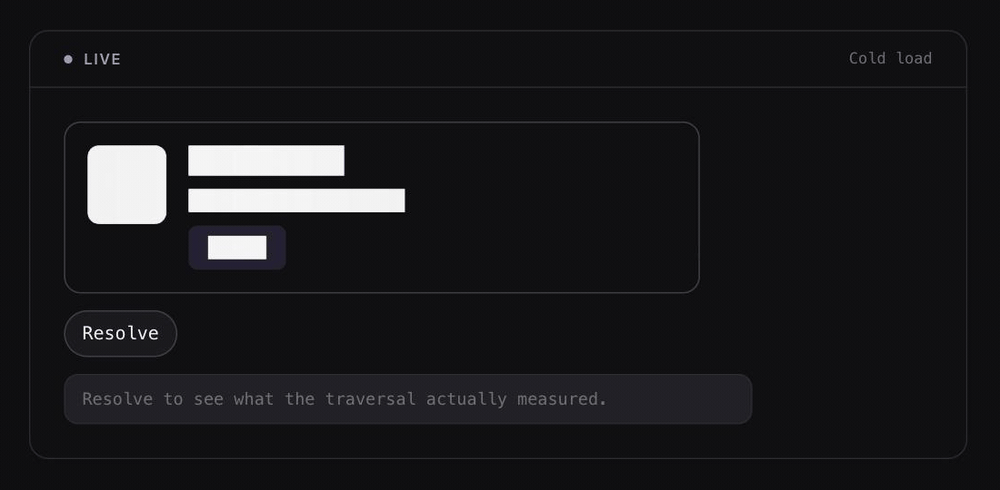
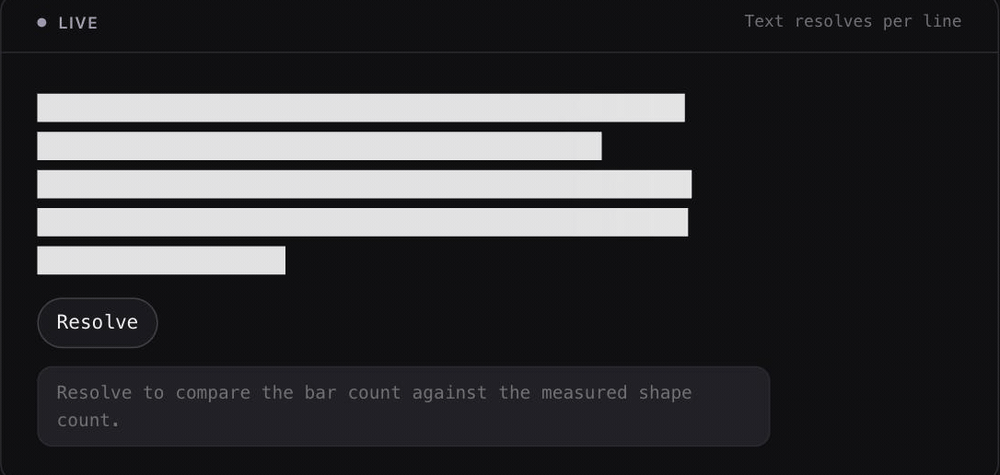
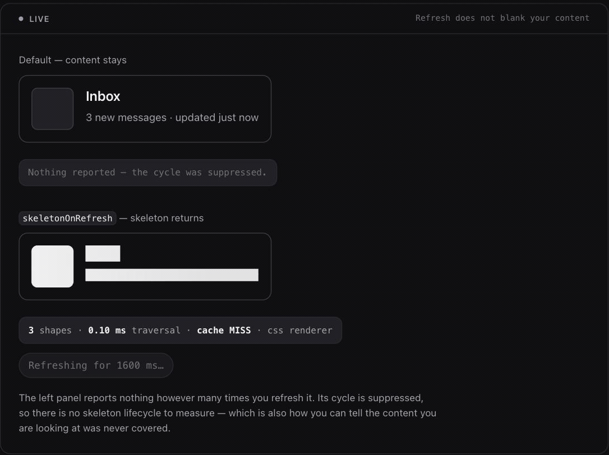
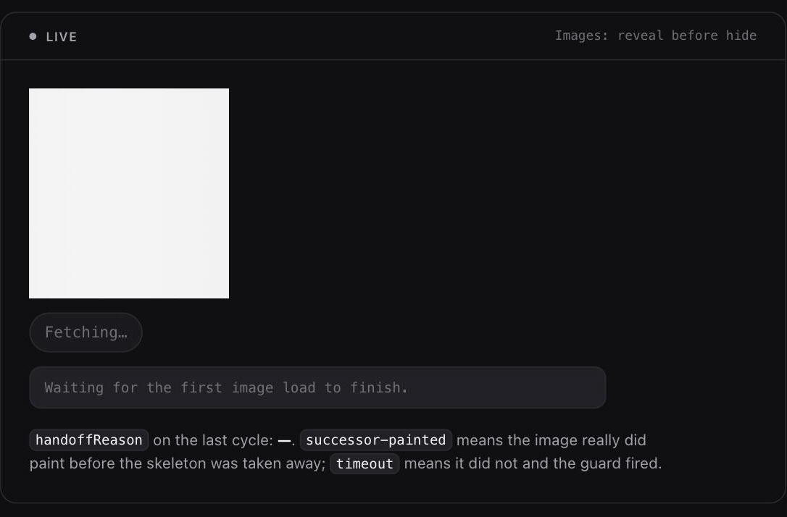

# autoskeleton

<!-- At publish time, add the npm version badge as the first entry in this row:
     [](https://www.npmjs.com/package/autoskeleton)
     It is deliberately absent until then, because an unpublished package renders
     it as a broken "invalid" badge. -->
<!-- The three workflow badges read live from GitHub Actions. All three run on
     every push to `main`; until the first such run they render "no status". -->
[](https://github.com/javier545dev/react-native-autoskeleton/actions/workflows/native-matrix.yml)
[](https://github.com/javier545dev/react-native-autoskeleton/actions/workflows/unit.yml)
[](https://github.com/javier545dev/react-native-autoskeleton/actions/workflows/playwright.yml)
[](LICENSE)
[](package.json)
[](benchmarks/budgets.json)

Automatic skeleton loaders for React Native and web. One sensor reads your
existing layout and paints a skeleton over the geometry it actually measured —
no hand-authored placeholder shapes, and no second component tree to keep in
sync with the real one.

<!-- VISUAL — recorded from the `examples/vite` `#/cold-load` demo: the cold
     mount, the skeleton measured from the card's own laid-out geometry, then
     the resolved "Ada Lovelace" article. Nothing in the frame is hand-drawn —
     the four shapes line up with the avatar, title, meta line and Follow
     action because they were measured from exactly those boxes.
     To re-record: `npm --prefix examples/vite run dev`, open `#/cold-load`,
     capture cold mount -> skeleton -> press Resolve -> content, and overwrite
     `docs/assets/cold-load.gif`. -->
<p align="center">
  
</p>

```tsx
import { AutoSkeleton } from 'autoskeleton';

function ProductCard({ product }: { product: Product | null }) {
  return (
    <AutoSkeleton skeletonKey="product-card" data={product}>
      {(product) => (
        <article className="card">
          
          <h2 className="card-title">{product.name}</h2>
          <p className="card-blurb">{product.blurb}</p>
        </article>
      )}
    </AutoSkeleton>
  );
}
```

That is the whole simple case. `data` is the loading state: `null` or
`undefined` means loading and **nothing else does** — `0`, `''` and `false` are
ordinary values that mean loaded. The function child runs only when `data` is
non-nullish, so `product` is a `Product` inside it and there is no second,
inverted null check to drift out of sync with the first. Plain children still
work unchanged, and `isLoading` is still there for a loading state `data`
cannot express — an `isFetching` flag, or one derived from several sources.
Pass both and `isLoading` wins.

`autoskeleton` measures the real card, caches the result under `skeletonKey`,
and replays a skeleton over the identical geometry on every later loading state
— including on a fresh mount, before the card exists at all.

**It measures what is inside the wrapper while the skeleton is up, and only
then.** In the form above the card does not exist while `product` is `null`, so
the *first* loading state of a session has nothing to measure and paints
nothing. Two ways out, either is fine: render structure that does not depend on
the data, which is measured and painted on that very first cycle — the
`#/cold-load` demo in [`examples/vite`](examples/vite) is exactly that — or hand
the wrapper a `fallback` for the cold case ([below](#the-cold-case-fallback)).

---

## Why not just draw one by hand?

The established skeleton libraries — `react-content-loader`,
`react-loading-skeleton`, and the rest of that category — hand you primitives
and ask you to arrange them into something that resembles your UI. That works.
It also means the skeleton is a second layout you now maintain: every padding
change, every font swap, every added line of copy is a change you have to make
twice, and nothing breaks when you only make it once.

`autoskeleton` never asks you to describe the layout, because it reads it.

- **Measured, not declared.** The shapes come from a traversal of the content's
  own laid-out geometry — `getBoundingClientRect` / `getComputedStyle` on web,
  a real post-layout `UIView` / `View` tree traversal on iOS and Android — taken
  on the first frame of the loading state and cached under `skeletonKey`.
- **Text resolves per line on web.** A wrapped paragraph is one element with one
  box; the skeleton is one bar per *line box*, fragmented through
  `Range.getClientRects()`, ragged last line included.

<p align="center">
  
</p>

<sub>The bar count is not a guess: the readout says <code>5 shapes</code> for the
five line boxes the browser laid out, and the last bar is short because the last
line is short.</sub>
- **One package, three targets.** Native, web DOM, and server rendering
  (`autoskeleton/ssr`, fed by a build-time capture CLI) resolve out of a single
  `exports` map by condition — not three packages to keep in step.
- **Zero runtime dependencies.** `package.json` has no `dependencies` field at
  all. Skia, Reanimated and uniwind are optional peers you opt into.
  `"sideEffects": false`.
- **The bundle size is a gate, not a promise.**
  `test/packaging/web-bundle.test.ts` builds a real consumer app, gzips the web
  entry, and fails CI above the ceiling in
  [`benchmarks/budgets.json`](benchmarks/budgets.json) — the single home of that
  number. On this commit: 7898 B against a 7933 B ceiling.

What it does **not** replace is a loading state you deliberately designed to
look *unlike* the content it precedes. If that is what you want, draw it by
hand — this library's whole premise is that the two should match.

---

## Is this for you?

**Yes if** you are on React Native 0.77+ with the New Architecture enabled and
a development build, or on the web, and you are tired of placeholder components
drifting away from the UI they are supposed to imitate.

**Read [`docs/platform-support.md`](docs/platform-support.md) first if** you
ship a universal Expo app, need the debug overlay on a device, or need
per-line text skeletons on native. Those are the three places where what works
on one platform does not work on another, and one of them fails without a
compile error.

**No if** you need Expo Go (a custom native module cannot exist there), or you
use NativeWind (it hard-requires Tailwind v3; this library's theming story is
v4 — [an explicit, evidence-backed exclusion](docs/theming.md), not a gap).

---

## Install

<!-- PRE-PUBLISH BLOCK — delete this entire block, comment markers included, on
     the day `autoskeleton` is published to npm. Nothing else in this README
     needs to change: every command below it is already the post-publish truth. -->
> **`autoskeleton` is not on npm yet.** The `npm install autoskeleton` lines
> below describe the published package; they do not work today. Until the first
> release, build the artifact and install it from the tarball — which is exactly
> how the five example apps in this repository consume it:
>
> ```bash
> git clone https://github.com/javier545dev/react-native-autoskeleton
> cd react-native-autoskeleton
> npm install
> npm run pack:tarball    # npm pack into .tarball/
> ```
>
> Then depend on it by path, as `examples/*/package.json` already do:
> `"autoskeleton": "file:../../.tarball/autoskeleton-0.1.0.tgz"`. Re-packing
> over an existing install has one sharp edge (npm trusts the lockfile
> `integrity` hash and silently keeps the stale bytes) — the fix, and
> `npm run examples:unpin`, are in
> [`docs/development.md`](docs/development.md).
<!-- END PRE-PUBLISH BLOCK -->

### Bare React Native — RN 0.77+, New Architecture (Fabric) only

```bash
npm install autoskeleton
cd ios && pod install
```

Autolinking is automatic via `@react-native-community/cli`. No manual native
project edits.

There is no old-architecture code path here and no flag to fall back to one.

**0.77 is the floor because that is where the registration this package needs
landed** — two independent mechanisms, either one of which would set it alone.
On iOS, `codegenConfig.ios.componentProvider` feeds
`RCTThirdPartyComponentsProvider.mm`, which does not exist before 0.77.0. On
Android, `AutoskeletonPackage.kt` builds `ReactModuleInfo` with Kotlin named
arguments, whose parameter names were renamed in 0.77.0. Below 0.77 the package
does not register at all — that is a missing module, not a degraded skeleton.

**On RN 0.77–0.81, "New Architecture" is a requirement you have to satisfy.** It
has been the default since 0.76, but `newArchEnabled=false` still works there,
and with it off this library has nothing to run. From 0.82 React Native refuses
that flag, so on 0.82+ the platform satisfies the requirement for you.

Your React version comes from React Native, not from us: RN 0.77 requires React
`^18.2.0`, 0.78 and 0.79 require `^19.0.0`, 0.80 and 0.81 require `^19.1.0`, and
0.87 requires `^19.2.3` — each release's own `peerDependencies` on npm. Install
what your RN release asks for; this package's `react: >=18.2.0` peer range is
deliberately wide enough not to argue with it.

The RN versions CI builds against live in
[`.github/workflows/native-matrix.yml`](.github/workflows/native-matrix.yml),
the single home of that list.

### Expo — development build required, SDK 53+

```bash
npx expo install autoskeleton
npx expo prebuild
npx expo run:ios     # or run:android, or an EAS development build
```

The peer range starts at RN 0.77, but **the Expo path effectively starts at SDK
53**, because no Expo SDK ships RN 0.77 or 0.78: SDK 52 is RN 0.76 and SDK 53 is
RN 0.79. There is nothing to install in between.

> **Expo Go does not work, and that is expected — not a bug to file.**
> `autoskeleton` ships a custom native Turbo Module, and custom native modules
> are absent from the prebuilt Expo Go binary by design.
>
> If you run under Expo Go anyway: in development it throws a named,
> actionable error at first use. In a shipped production build it fails open —
> `children` render unwrapped (no skeleton, no crash) and `onMetrics` reports
> `degraded: ['native-module-unavailable']`, so a stray Expo Go install is
> visible in telemetry rather than silently invisible.

### Web

```bash
npm install autoskeleton
```

Nothing else. The native Turbo Module never enters a web bundle — the web
entry's transitive import graph contains no `react-native` specifier at all,
which `test/packaging/entries.test.ts` asserts.

---

## The one behaviour that surprises everyone

**By default, once content has been shown, `isLoading` going back to `true`
does not bring the skeleton back.** The already-rendered content stays on
screen.

That is deliberate: a pull-to-refresh should not blank out the list the reader
is currently looking at. It is also the single most common "my skeleton stopped
working" report, because the first load looks perfect and every load after it
appears to do nothing.

```tsx
<AutoSkeleton isLoading={isLoading} skeletonKey="feed" skeletonOnRefresh>
```

`onMetrics` also stays silent for a suppressed cycle, for the same reason: no
skeleton-to-content lifecycle visually occurred.

<p align="center">
  
</p>

<sub>Both panels get the same prop sequence at the same instant; the only
difference is <code>skeletonOnRefresh</code>. The suppressed one reports nothing
at all — that silence is the contract, not a gap.</sub>

### Images hand off without a gap — on web

The frame after a skeleton disappears is where loading states usually break:
the image has been told to load but has not painted, so the reader gets a
flash of nothing. On web the skeleton is held until an `` successor has
actually decoded and painted. `onMetrics` reports which happened —
`successor-painted` means the image really did paint first, `timeout` means it
did not and the guard fired, because a skeleton that waits forever on an image
that never loads would be worse than a brief gap.

<p align="center">
  
</p>

This one is honestly platform-split, and the table below says so: automatic
successor-paint detection is a web capability. On iOS and Android the handoff
is timing-based, and `expectsPlaceholder` is how you tell it a placeholder is
coming — see [`docs/image-pipeline.md`](docs/image-pipeline.md).

---

## What works where

The short version. The long version, with the mechanism behind every gap, is
[`docs/platform-support.md`](docs/platform-support.md).

| | Web | iOS | Android |
|---|---|---|---|
| `<AutoSkeleton>`, `Ignore`, `Hint` | yes | yes | yes |
| Per-line text skeletons | **yes, per line box** | one block per `<Text>` | one block per `<Text>` |
| Virtualized-list API (`SkeletonList` & co.) | **no** | yes | yes |
| `autoskeleton/uniwind` theming | **no** | yes | yes |
| Per-instance `shimmerBaseColor` etc. | **no** | yes | yes |
| CSS-variable / Tailwind v4 theming | yes | n/a | n/a |
| `debugOverlay` draws | yes | **no** | **no** |
| Automatic successor-paint detection | yes | **no** | **no** |
| Clipping to scroll containers | yes | yes | yes |
| Shimmer sweep follows writing direction | **no** | yes | yes |
| Tier-2 Skia renderer (opt-in) | n/a | yes | yes |
| Server rendering (`autoskeleton/ssr`) | yes | n/a | n/a |

Two of these bite hardest:

- **The virtualized-list API is native-only and its absence on web is a runtime
  `undefined`, not a compile error.** `expo/tsconfig.base.json` pins
  `customConditions: ['react-native']` for the whole project, so one tsconfig
  typechecks a universal app against the native declarations. Verified by
  running: `tsc --noEmit` exits 0 and `expo export --platform web` bundles
  cleanly. Guard list code with `Platform.OS !== 'web'` or a `.native.tsx`
  file.
- **`debugOverlay` draws on web only.** On iOS and Android the prop is
  accepted, stored, and never read. A blank overlay there is our gap, not your
  configuration.

---

## Examples

Five real apps, each installing the library from a packed tarball rather than a
workspace symlink, so what they exercise is the published artifact:

- [`examples/bare-rn`](examples/bare-rn) — bare RN, the full demo gallery, the
  on-device paint gates.
- [`examples/expo`](examples/expo) — Expo autolinking, `autoskeleton/uniwind`,
  `expo-image`, Expo Web.
- [`examples/next`](examples/next) — server rendering.
- [`examples/vite`](examples/vite) — an ordinary web SPA.
- [`examples/rn-077`](examples/rn-077) — the RN 0.77 floor app. It exists to
  prove the declared `peerDependencies` floor still builds and runs, and the
  native matrix builds it on every push.

The rest of this section is one worked example per surface.

### React Native — the same component, unchanged

```tsx
import { Image, Text, View } from 'react-native';
import { AutoSkeleton } from 'autoskeleton';

function ProductCard({ product }: { product: Product | null }) {
  return (
    <AutoSkeleton skeletonKey="product-card" data={product}>
      {(product) => (
        <View style={styles.card}>
          <Image style={styles.cardImage} source={{ uri: product.imageUrl }} />
          <Text style={styles.cardTitle}>{product.name}</Text>
          <Text style={styles.cardBlurb}>{product.blurb}</Text>
        </View>
      )}
    </AutoSkeleton>
  );
}
```

Line for line the quickstart, with `article`/`img`/`h2` swapped for
`View`/`Image`/`Text`. Same specifier, same props, same semantics: `exports`
resolves `autoskeleton` to a different file per platform condition, so there is
no native-flavoured API to learn. What changes underneath is the sensor — a
real post-layout `UIView` / `View` tree traversal instead of
`getBoundingClientRect`. Only three props are native-only
([Theming](#theming)); the rest of [`docs/api.md`](docs/api.md) is both.

### Server rendering — `autoskeleton/ssr`

```tsx
// app/dashboard/page.tsx
import { Suspense } from 'react';
import { AutoSkeletonSSR } from 'autoskeleton/ssr';
import { manifest } from '../../generated/autoskeleton-ssr';
import { DashboardContent } from './DashboardContent';

export default function DashboardPage() {
  return (
    <Suspense fallback={<AutoSkeletonSSR skeletonKey="dashboard" manifest={manifest} direction="ltr" />}>
      <DashboardContent />
    </Suspense>
  );
}
```

A Suspense fallback renders *before* its children exist, so there is nothing to
measure on the server — live detection is architecturally impossible there,
rather than merely unimplemented. `<AutoSkeletonSSR>` replays a **build-time
capture** instead, and one command produces it:

```bash
npx autoskeleton-capture ./autoskeleton.capture-registry.json http://127.0.0.1:3000 ./generated/autoskeleton-ssr
```

The registry is plain JSON mapping each `skeletonKey` to a route that renders
the markup you want captured. The CLI drives headless Chromium (via
`@playwright/test`, an optional peer) over each route, runs the *real* DOM
sensor at every width bucket × direction, and writes `manifest.json` +
`bundle.css`. Import the CSS once globally and mount
`<AutoSkeletonSSRHydrate manifest={manifest} />` in your root layout: it renders
`null` and imports the captured snapshots into the runtime store, so a
client-side `<AutoSkeleton>` for the same key gets a cache hit instead of a cold
traversal.

Both are named exports from `autoskeleton/ssr` — there is no `AutoSkeleton.SSR`.
An uncaptured key renders a neutral generic block, byte-identical on server and
client, so a forgotten registry entry costs you a plainer skeleton and never a
hydration mismatch. That hand-maintained registry is a real ergonomic tax, and
[`docs/ssr-capture-cli.md`](docs/ssr-capture-cli.md) names it openly alongside
the build token that stops the manifest and the CSS from drifting apart.

### Virtualized lists — **native only**

```tsx
import { FlashList } from '@shopify/flash-list';
import { SkeletonCell, SkeletonList } from 'autoskeleton';

// The real row is also the template. One source of truth, so the placeholder
// cannot drift from the content.
const feedRowTemplate = () => <FeedRow title="" />;

function Feed({ feed }: { feed: readonly FeedItem[] | null }) {
  if (feed === null) {
    return (
      <SkeletonList itemType="feed-row" estimatedCount={6} renderTemplate={feedRowTemplate} rowSpacing={8} />
    );
  }
  return (
    <FlashList
      data={feed}
      renderItem={({ item }) =>
        item.loaded ? (
          <FeedRow title={item.title} />
        ) : (
          <SkeletonCell itemType="feed-row" renderTemplate={feedRowTemplate} />
        )
      }
    />
  );
}
```

A list cannot measure itself the way a card does: on the initial load there are
no cells yet, and a traversal on bind would stutter the recycler. So one
invisible template cell is measured **once per `itemType` for the whole app
session**, deferred until interactions settle, and every skeleton row after that
is drawn from the cached snapshot. Binding a cell is one synchronous cache read
— no sensor call is reachable from that path, and `templateTraversalCounter` is
exported so you can prove it in your own app. `<SkeletonListFooter>` is the same
component as a `ListFooterComponent` during pagination, and `useSkeletonCell()`
is the hook underneath, for a cell you render yourself:

```tsx
const { snapshot, cacheHit, isFallback, cacheKey } = useSkeletonCell({ itemType: 'feed-row' });
```

**This API is native-only, and its absence on web is a runtime `undefined`, not
a compile error** — [What works where](#what-works-where) above, and
[`docs/platform-support.md` §3a](docs/platform-support.md), have the mechanism
that keeps TypeScript quiet. An `itemType` you never give a `renderTemplate` also
renders the generic fallback block forever; that is a documented v1 limitation,
not a bug. [`docs/lists.md`](docs/lists.md).

### Theming

Web themes through the cascade — nothing to import, no props to pass:

```css
:root { --skl-base: #e2e8f0; --skl-highlight: #f8fafc; }
.dark { --skl-base: #1e293b; --skl-highlight: #334155; }
```

While the theme is still the untouched default the renderer writes no inline
colour at all and defers to your stylesheet, which is what makes a dark-mode
class flip retheme every skeleton with no React state involved. Tailwind v4
`@theme` tokens compile to exactly these two custom properties, so that path
needs no interop either.

<p align="center">
  
</p>

<sub>Three identical components, three different skeletons, zero props. The only
difference is which element each is nested inside: the first two sit under
containers declaring their own <code>--skl-base</code>/<code>--skl-highlight</code>,
and the third declares nothing, so it inherits whatever <code>:root</code>
says.</sub>

Native has no cascade, so the same two colours come from a provider — which
works on web too, and beats the CSS variables once you set it:

```tsx
import { SkeletonProvider } from 'autoskeleton';

<SkeletonProvider theme={{ baseColor: '#1e293b', highlightColor: '#334155', defaultRadius: 12 }}>
  <App />
</SkeletonProvider>;
```

A single instance can override part of that with `shimmerBaseColor`,
`shimmerHighlightColor` or `defaultRadius` — the three native-only props; the
web `AutoSkeletonProps` does not declare them. `autoskeleton/uniwind` resolves
one Tailwind `className` onto those same three, also native-only.
[`docs/theming.md`](docs/theming.md) has the Android `defaultRadius` caveat and
why NativeWind is an explicit exclusion rather than a gap.

### The cold case: `fallback`

```tsx
<AutoSkeleton
  skeletonKey="product-card"
  data={product}
  fallback={<ProductCardSkeleton />}
>
  {(product) => <ProductCard product={product} />}
</AutoSkeleton>
```

`fallback` renders on a **cold miss only** — loading with no cached geometry for
this key. It never replaces a measured skeleton and never renders once the
geometry is known, so it is not a second layout you maintain forever: it covers
the one cycle before there is anything to replay, and it is the migration ramp
off the hand-authored skeleton you already own. Omit it and every existing
render path behaves exactly as it did.

This is the other half of the note under the quickstart: with a function child
the wrapper has nothing inside it to measure while it is loading, so on a cold
key the fallback is what paints.

---

## Documentation

**Getting things done**

- **[API reference](docs/api.md)** — every export, every prop, per-platform
  availability, and the composite cache key.
- **[Platform support and known limitations](docs/platform-support.md)** — the
  honest capability matrix and the mechanism behind every gap.
- **[Troubleshooting](docs/troubleshooting.md)** — symptom → cause → fix,
  including why a library change may not appear in an example app.
- **[Virtualized lists](docs/lists.md)** — native-only, and the explicit-width
  constraint you will hit first.
- **[TypeScript configuration](docs/typescript.md)** — the `moduleResolution`
  and `customConditions` settings the per-platform types need, and the separate
  one Jest needs.

**Going deeper**

- **[Theming](docs/theming.md)** — the three mechanisms and where each works;
  `autoskeleton/uniwind`; why NativeWind is a non-goal.
- **[Animation and reduced motion](docs/animation.md)** — `shimmer` / `pulse` /
  `none`, and how the OS preference is honoured.
- **[Observability](docs/observability.md)** — `onMetrics` (with a
  **per-platform table of which fields are real**), `debugOverlay`, dev
  warnings, native profiler markers.
- **[Image loading pipeline](docs/image-pipeline.md)** — the
  skeleton → placeholder → image handoff, with a worked `expo-image` example
  that is typechecked in CI against real types.
- **[SSR capture CLI](docs/ssr-capture-cli.md)** — build-time snapshot capture
  for `<AutoSkeletonSSR>`, and the registry-maintenance cost named openly.
- **[The Skia renderer (tier 2)](docs/tier2-skia.md)** — the opt-in second
  native renderer, and what the two tiers do and do not share.

**Contributing**

- **[Working on autoskeleton](docs/development.md)** — repo layout, test
  commands, the example apps, and the stale-tarball chain.
- `docs/product-brief.md`, `plan.md`, `spec.md` and `tasks.md` are the design
  and planning record. They document *intent*; where they disagree with the
  code, the code wins.

---

## Going further

**[The Skia renderer (tier 2)](docs/tier2-skia.md).** The default native
renderer has no dependencies and draws on the platform's own compositor, so the
shimmer keeps running even when the JS thread is blocked. A second renderer
draws the same skeleton with `@shopify/react-native-skia` and
`react-native-reanimated`. It is strictly opt-in, and installing the two
packages is deliberately *not* enough — you build the overlay from your own
imports and hand it to `SkeletonProvider`, because Metro's dependency graph is
static. The doc covers the wiring, the Babel plugin ordering, and the honest
caveat: the two tiers share a shimmer period but not a phase origin, so there
is a fixed arbitrary offset between tier-1 and tier-2 instances.

**[TypeScript configuration](docs/typescript.md).** This package publishes
different type declarations per platform condition, so your `tsconfig.json`
needs `"moduleResolution"` set to `bundler`/`node16`/`nodenext` — the classic
`"node"` resolution ignores `package.json#exports` entirely. React Native
consumers already get the `react-native` condition from
`@react-native/typescript-config` or `expo/tsconfig.base`; web consumers need
nothing. Jest is a separate problem: its resolver does not apply `exports`
conditions at all, so a React Native test environment silently gets the web
build without `customExportConditions`.

---

## License

MIT © Javier Fuentes
