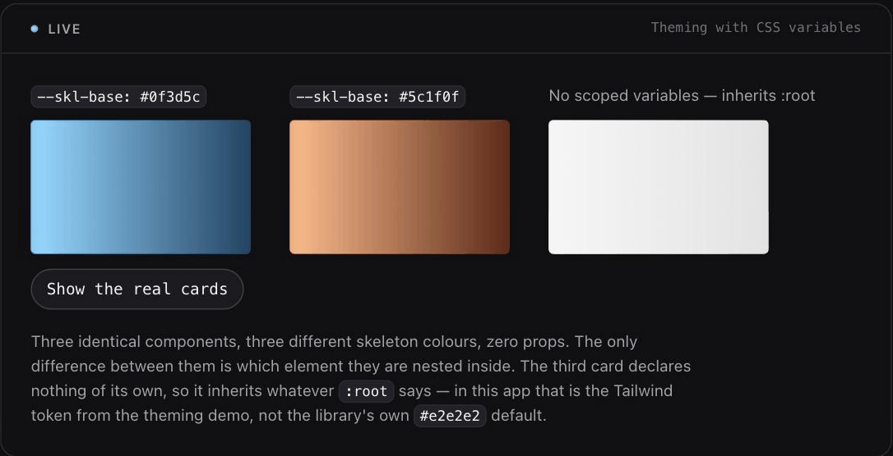

# Theming

`autoskeleton` ships **one** theming interop: `autoskeleton/uniwind`. This
document explains what it does, and why NativeWind is an explicit,
documented non-goal rather than a "coming soon" gap.

## The core sensor is styling-agnostic, always

`src/core/` never imports a styling library and never parses a `className`
string — this is statically asserted by
`test/packaging/core-styling-agnostic.test.ts` (spec REQ-THEME-3). Every
theming interop operates purely at the React **props** layer, upstream of
`<AutoSkeleton>`'s own render path.

## The three ways to theme, and where each works

<p align="center">
  
</p>

<sub>Three identical components, three skeleton colours, **zero props**. The
only difference between them is which element they are nested inside: the first
two sit under scopes declaring `--skl-base`, the third declares nothing and
inherits `:root`. Recorded from the `examples/vite` `#/css-variables` demo.</sub>

| Mechanism | Web | iOS | Android |
|---|---|---|---|
| `SkeletonProvider theme={{ baseColor, highlightColor, defaultRadius, speedMs }}` | yes | yes | yes (radius caveat below) |
| CSS custom properties / Tailwind v4 `@theme` (`--skl-base`, `--skl-highlight`) | yes | n/a | n/a |
| Per-instance props `shimmerBaseColor` / `shimmerHighlightColor` / `defaultRadius` | **no** | yes | yes (radius caveat below) |
| `autoskeleton/uniwind`'s `<ThemedAutoSkeleton className>` | **no** | yes | yes (radius caveat below) |

### `SkeletonProvider theme` — everywhere

```tsx
<SkeletonProvider theme={{ baseColor: '#1e293b', highlightColor: '#334155', defaultRadius: 12, speedMs: 1400 }}>
  <App />
</SkeletonProvider>
```

Defaults are `defaultRadius: 4`, `speedMs: 1400`, and platform-specific colours
(`'#e2e2e2'` / `'#f5f5f5'` on native; on web the values the renderer's own
stylesheet uses as its `var(--skl-base, …)` fallback, imported rather than
duplicated so the two cannot drift).

`speedMs` is **first-writer-wins** across the whole JS context — see
[`observability.md` §3.3](./observability.md).

`SkeletonTheme` itself is not exported from any entry, so pass an object
literal; it infers correctly.

### Per-instance props — **native only**

```tsx
<AutoSkeleton
  isLoading={isLoading}
  skeletonKey="product-card"
  shimmerBaseColor="#1e293b"
  shimmerHighlightColor="#334155"
  defaultRadius={12}
/>
```

These three props are declared on the **native** `AutoSkeletonProps` only. The
web `AutoSkeletonProps` does not have them — on web, theme through the CSS
cascade (next section) or through `SkeletonProvider`.

They layer on top of the context theme rather than replacing it: only fields
you actually define are overridden.

> **Android caveat for `defaultRadius`.** Android's radius ladder answers
> definitively at rung R1 for a view with no background drawable
> (`radius = 0, source = 'measured'`), and most RN views have no background —
> so `defaultRadius` is never consulted for them and has no visible effect.
> Use `<AutoSkeleton.Hint radius={n}>`, which is rung R0 and always wins.
> Full detail in [`platform-support.md` §5d](./platform-support.md).

### CSS custom properties — web

Nothing to import and no props to pass. When the theme is still the untouched
default, the renderer defers to the cascade:

```css
:root { --skl-base: #e2e8f0; --skl-highlight: #f8fafc; }
.dark { --skl-base: #1e293b; --skl-highlight: #334155; }
```

A dark-mode toggle is a pure class flip, with no React state involved. Tailwind
v4 `@theme` tokens compile to exactly these custom properties, which is why the
Tailwind path needs no interop at all — verified against a real production build
in `test/web/tailwind-app-theme.spec.ts`, which samples painted pixels at pinned
shimmer phases.

`autoskeleton/uniwind` exists purely to let a **native** consumer set the three
per-instance props from ONE Tailwind `className` instead.

## `autoskeleton/uniwind` — **native only**

> This subpath imports the native `<AutoSkeleton>`, which reaches
> `react-native/Libraries/Utilities/codegenNativeComponent`. **A web build
> fails at bundle time** with `Importing native-only module
> "react-native/Libraries/Utilities/codegenNativeComponent" on web`. That is a
> loud, correct failure, not a silent one — but it does mean a universal app
> must split its entry (`App.web.tsx` next to `App.tsx`), which is exactly why
> `examples/expo` does. On web, use the CSS-custom-property path above.

```tsx
import { ThemedAutoSkeleton } from 'autoskeleton/uniwind';

<ThemedAutoSkeleton
  className="bg-slate-200 rounded-lg"
  isLoading={isLoading}
  skeletonKey="product-card"
/>;
```

`ThemedAutoSkeleton` wraps the native `<AutoSkeleton>` with `uniwind`'s
`withUniwind(Component, options)` manual-mapping API, resolving:

| Resolved from `className` | Style property | Mapped prop |
|---|---|---|
| `bg-*` | `backgroundColor` | `shimmerBaseColor` |
| `text-*` | `color` | `shimmerHighlightColor` |
| `rounded-*` | `borderRadius` | `defaultRadius` |

The **colour** half of this mapping was verified on a real Android emulator
(`examples/expo`'s `npm run gate:uniwind`, which polls the raw device
framebuffer): the rendered shimmer gradient genuinely matched
`bg-slate-400`/`text-cyan-300`, not the library's JS defaults.

The **radius** half is not gated, and the reason is measured rather than
assumed: a `rounded-2xl` class resolves to a `defaultRadius` that Android never
consults for a view with no background drawable, so the gate card paints a
square mask while a card with its own `borderRadius: 16` paints a rounded one.
Use `<AutoSkeleton.Hint radius>` on Android. iOS is unaffected. See
[`platform-support.md` §5d](./platform-support.md).

**Requirements**: `uniwind` (>= 1.11.0, `uni-stack/uniwind`) and
`tailwindcss` v4 (`@theme` CSS-first syntax) as peer dependencies. Neither
is a hard dependency of `autoskeleton` itself — `autoskeleton/uniwind` is an
optional subpath export; if you never import it, you never need `uniwind`
installed at all.

## NativeWind — explicit non-goal, not a gap

`autoskeleton` does **not** support NativeWind, and this is a deliberate,
evidence-backed decision (plan.md ADR-17), not an oversight:

1. **NativeWind 4.2.6 hard-requires Tailwind CSS v3.** Verified directly
   from the published package: it throws `"NativeWind only supports
   Tailwind CSS v3"` at Metro config load if Tailwind v4 is installed —
   unconditional, not a configuration mistake you can work around.
2. This project's entire theming story is Tailwind **v4** (`@theme`,
   CSS custom properties). A NativeWind consumer is, by construction, a
   Tailwind v3 consumer — the two are incompatible at the root.
3. **`uniwind` and `nativewind` cannot even share one `node_modules` tree**
   — they require conflicting Tailwind CSS majors. A project using
   NativeWind for the rest of its UI cannot install `autoskeleton/uniwind`
   alongside it without a broken build.

If your app already uses NativeWind, use `autoskeleton`'s prop-level API
directly (`shimmerBaseColor`/`shimmerHighlightColor`/`defaultRadius`) —
those props work with any styling approach, since they are plain React
props with no interop involved. If a future NativeWind major drops the
Tailwind v3 requirement, this decision should be revisited (ADR-17 says so
explicitly) — it is a measured-fact decision, not a permanent ideological
one.

## `uniwind` is not NativeWind's engine

One easy mix-up: `uniwind` (`uni-stack/uniwind`, from the Unistyles team)
and NativeWind are two **independent, competing** projects — `uniwind` is
not "NativeWind under a different name," and NativeWind's own engine is a
separate package, `react-native-css`. `autoskeleton/uniwind` integrates
with `uniwind` specifically.
