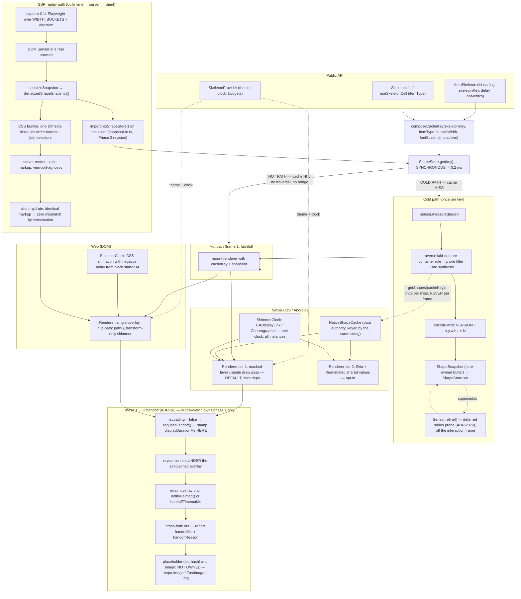

# Technical Design — `autoskeleton` v1 (`auto-skeleton-v1`)

> Phase 2 deliverable. Source of truth: `docs/product-brief.md` (read in full; sections 2 and 14
> supersede the proposal where they differ). Upstream artifacts: Engram `sdd/auto-skeleton-v1/proposal`,
> `sdd/auto-skeleton-v1/explore`.
> Package identifier is **`autoskeleton`**. `auto-skeleton` is taken on npm and must never appear as a
> package name.
> `execution_mode: auto` — no interactive questions were possible. Every assumption is stated inline as
> **ASSUMPTION**.

---

## 1. Technical approach in one paragraph

Three contracts (`Sensor`, `Renderer`, `ShapeStore`) and one clock (`ShimmerClock`) live in `src/core/`
as pure TypeScript with zero platform imports. Platform layers supply implementations. All geometry is
expressed in a single transport-independent numeric layout — `[VERSION][x,y,w,h,r] x N` — so the same
bytes describe a live native traversal, a cached hot-path hit, and a build-time SSR capture. Two paths
exist and are architecturally distinct: the **cold path** traverses a real laid-out tree and writes a
snapshot; the **hot path** is a synchronous key lookup with no traversal and no bridge crossing. SSR is
the extreme cold path, moved to build time, because a Suspense fallback has no layout to sense at request
time on any machine.

Two scope boundaries frame everything below. **First, bare React Native and Expo are co-equal
first-class targets** (brief §1, §3b): one published tarball must satisfy two independent autolinking
mechanisms, and only a bare example app building in CI proves it (ADR-14, ADR-15). **Second,
`autoskeleton` owns the skeleton phase only** — it cedes control at the skeleton → placeholder boundary
and never implements, decodes or manages blurhash (brief §9b, ADR-16). Both boundaries have contracts in
§3, not prose.

---

## 2. Module layout (planned, not created by this phase)

| Path | Role |
|---|---|
| `src/core/types.ts` | `ShapeInfo`, `ShapeSnapshot`, wire constants, `DegradationFlag`, metrics payload |
| `src/core/contracts.ts` | `Sensor`, `Renderer`, `ShapeStore`, `ShimmerClock` |
| `src/core/cache-key.ts` | `composeCacheKey` / `parseCacheKey`, bucketing + quantization |
| `src/core/wire.ts` | encode/decode of the `Float32Array` layout, version negotiation |
| `src/core/snapshot.ts` | `MemoryShapeStore` (hot path only, since Phase 2 — see §3.3) |
| `src/core/snapshot-io.ts` | `serializeSnapshot` / `deserializeSnapshot`, `exportShapeStore` / `importIntoShapeStore` (opt-in, split out in Phase 2 — see §3.3) |
| `src/core/lines.ts` | collapsed-text line synthesis heuristics |
| `src/core/clip-path.ts` | union-of-rounded-rects → SVG `path()` string (pure, web + capture CLI) |
| `src/core/metrics.ts` | budget checks, dev warnings, `onMetrics` assembly |
| `src/core/handoff.ts` | phase-1 → phase-2 handoff controller, image leaf descriptors (ADR-16) |
| `src/native/` | Turbo Module TS spec, native sensor (Swift/Kotlin), tier-1 renderer, tier-2 Skia renderer |
| `src/web/` | DOM sensor, CSS renderer, SSR hydration bridge |
| `src/index.native.ts`, `src/index.web.ts` | mandatory explicit entry pair (ADR-3) |
| `src/index.ts` | web-safe alias (`export * from './index.web'`) — exists so `lib/**/index.js` exists; never the resolution mechanism (ADR-3) |
| `ios/Autoskeleton.podspec` (root `*.podspec`) | required by `@react-native-community/cli` iOS autolinking (ADR-14) |
| `android/build.gradle` | required by CLI Android autolinking (ADR-14) |
| `react-native.config.js` | CLI autolinking platform descriptor (ADR-14) |
| `expo-module.config.json` | present only if ADR-14's verification task proves Expo needs it |
| `cli/` | build-time snapshot capture (Playwright), dev-dependency only |
| `examples/bare-rn` | **bare React Native, CLI autolinking — co-equal target, not optional** (ADR-14, §7.4a) |
| `examples/expo`, `examples/vite`, `examples/next` | Expo dev build (Expo autolinking), web SPA, SSR proof surfaces |

---

## 3. Complete TypeScript contracts

### 3.1 Primitives

```ts
// src/core/types.ts
export type Platform = 'ios' | 'android' | 'web';
export type RendererKind = 'native' | 'skia' | 'css';
export type AnimationKind = 'shimmer' | 'pulse' | 'none';
export type Direction = 'ltr' | 'rtl';

/** Debug/telemetry classification. NEVER travels on the hot wire (see §4). */
export type ShapeSource =
  | 'text'
  | 'image'
  | 'input'
  | 'background'
  | 'synthetic-line'
  | 'container';

/** Where a shape's corner radius actually came from. Mandatory telemetry (ADR-2). */
export type RadiusSource = 'measured' | 'outline' | 'raster-probe' | 'hint' | 'default';

/** Every silent-degradation mode must be nameable. */
export type DegradationFlag =
  | 'radius-unavailable'        // rounded confirmed, amount unknown -> defaultRadius used
  | 'radius-probe-failed'       // raster probe attempted and could not classify
  | 'leaf-class-unmatched'      // a subtree produced only background shapes
  | 'budget-exceeded'           // traversal exceeded budgetMs and was truncated
  | 'shape-cap-reached'         // maxShapes hit, tail discarded
  | 'clientrects-empty'         // DOM per-line measurement returned no rects
  | 'snapshot-version-mismatch' // stored snapshot rejected by wire version negotiation
  | 'native-module-unavailable';// Expo Go: the Turbo Module is not in the binary (ADR-15)

/** One placeholder rectangle in the root/wrapper coordinate space, in CSS px (web)
 *  or density-independent points (native). `r` is a single uniform corner radius;
 *  per-corner radii are out of scope for v1 (brief §13). */
export interface ShapeInfo {
  readonly x: number;
  readonly y: number;
  readonly w: number;
  readonly h: number;
  readonly r: number;
  /** dev builds only; absent in production snapshots */
  readonly source?: ShapeSource;
  readonly radiusSource?: RadiusSource;
}
```

### 3.2 Composite cache key

```ts
// src/core/cache-key.ts
export interface CacheKeyParts {
  readonly skeletonKey: string;
  /** virtualized-list cell type; `undefined` for whole-screen skeletons */
  readonly itemType?: string;
  /** already bucketed by `bucketWidth` — never a raw viewport width */
  readonly viewportWidth: number;
  /** already quantized by `quantizeFontScale` */
  readonly fontScale: number;
  readonly direction: Direction;
  readonly platform: Platform;
}

/** Opaque, order-stable, and safe to use as an object key, a CSS class suffix and a
 *  filename fragment. Branded so a raw string can never be passed by accident. */
export type ShapeCacheKey = string & { readonly __brand: 'ShapeCacheKey' };

/** Width buckets are shared by the runtime AND the SSR capture CLI. Divergence between
 *  the two is a hydration bug by construction, so there is exactly one table. */
export const WIDTH_BUCKETS: readonly number[] = [320, 375, 414, 768, 1024, 1280, 1536];

export declare function bucketWidth(px: number): number;
/** quantized to 2 decimals; anything finer thrashes the cache without changing layout */
export declare function quantizeFontScale(scale: number): number;

export declare function composeCacheKey(parts: CacheKeyParts): ShapeCacheKey;
export declare function parseCacheKey(key: ShapeCacheKey): CacheKeyParts;
/** Bulk invalidation predicate support without re-parsing at every call site. */
export declare function keyMatches(
  key: ShapeCacheKey,
  predicate: (parts: CacheKeyParts) => boolean,
): boolean;
```

`composeCacheKey` produces `v1|<skeletonKey>|<itemType|'-'>|<width>|<fontScale>|<dir>|<platform>` with
each user-supplied segment percent-escaped for `|`. Deterministic, reversible, and printable in the debug
overlay.

### 3.3 Snapshot and `ShapeStore`

```ts
// src/core/types.ts (cont.)
export const WIRE_VERSION = 1;

/** Runtime form. `data` follows the §4 wire layout and is OWNED by this snapshot. */
export interface ShapeSnapshot {
  readonly key: ShapeCacheKey;
  /** wire schema version, mirrored from data[0] for cheap checks */
  readonly version: number;
  readonly capturedAt: number;
  /** the wrapper frame the shapes are relative to; needed to scale on near-miss reuse */
  readonly frameWidth: number;
  readonly frameHeight: number;
  readonly data: Float32Array;
  /** dev-only sidecars, index-aligned with the shape index (see §4.4) */
  readonly sources?: Uint8Array;
  readonly radiusSources?: Uint8Array;
  readonly degraded: readonly DegradationFlag[];
}

/** JSON-safe. This is what the capture CLI writes, what v2 disk persistence will store,
 *  and what crosses the SSR boundary. No ArrayBuffers, no NaN, no Infinity. */
export interface SerializedShapeSnapshot {
  readonly v: number;
  readonly key: string;
  readonly capturedAt: number;
  readonly frame: readonly [number, number];
  /** identical slot layout to the runtime wire, as plain numbers */
  readonly data: readonly number[];
  readonly sources?: readonly number[];
  readonly radiusSources?: readonly number[];
  readonly degraded?: readonly DegradationFlag[];
}
```

**PHASE 2 REVISION (task 2.5, NFR-6 remediation — read before the two blocks below):** the sketch
above and originally below this note put `serializeSnapshot`/`deserializeSnapshot` in `snapshot.ts`
next to `MemoryShapeStore`, and `export()`/`import()` directly on the `ShapeStore` contract. As shipped,
that coupled the hot-path `get`/`set`/`has` methods `AutoSkeleton` calls at runtime to serialization
logic only the Phase 8 capture CLI and v2 disk persistence need — and a bundler cannot tree-shake
individual class methods, so `export()`/`import()` (and everything they called) rode into every web
bundle regardless of use, contributing to the NFR-6 gzip overrun this task closes. **What actually
ships**: `serializeSnapshot`/`deserializeSnapshot` and two new free functions,
`exportShapeStore`/`importIntoShapeStore`, all live in a new file, `src/core/snapshot-io.ts` — not in
`snapshot.ts` and not as class methods. `snapshot.ts` keeps only the hot-path `ShapeStore`
implementation plus one small `values(): IterableIterator<ShapeSnapshot>` iteration delegate (the
minimal seam `exportShapeStore` needs; it carries no serialization logic itself). `ShapeStore.export()`
/`.import()` are REMOVED from the contract entirely — bulk serialization is opt-in, not a hot-path
requirement every implementation must carry. `ImportReport` stays in `contracts.ts` (still the shared
result shape). Measured effect: raw bundle 23076 B → 22105 B (-971 B), gzip 7566 B → 7421 B (-145 B) —
a real but modest saving (gzip already compresses the repetitive serialization code well; the split's
main value is the tree-shaking-correctness fix, not a specific byte target).

```ts
// src/core/snapshot-io.ts (Phase 2 revision — was src/core/snapshot.ts)
export declare function serializeSnapshot(s: ShapeSnapshot): SerializedShapeSnapshot;
/** Throws `WireVersionError` when `s.v > WIRE_VERSION`; returns a forward-migrated
 *  snapshot when `s.v < WIRE_VERSION`. */
export declare function deserializeSnapshot(s: SerializedShapeSnapshot): ShapeSnapshot;

/** Minimal read seam a store needs to support bulk export; `MemoryShapeStore` satisfies
 *  this structurally via `values()`. */
export interface ShapeSnapshotSource {
  values(): Iterable<ShapeSnapshot>;
}
/** Opt-in. The capture CLI writes this output; nothing in the live web/native runtime
 *  calls it, so it tree-shakes out of a production bundle. */
export declare function exportShapeStore(store: ShapeSnapshotSource): readonly SerializedShapeSnapshot[];
/** Opt-in. The SSR client and v2 disk persistence feed this via the target store's
 *  ordinary `set()` — no dedicated class method required. */
export declare function importIntoShapeStore(
  store: Pick<ShapeStore, 'set'>,
  entries: readonly SerializedShapeSnapshot[],
): ImportReport;
```

```ts
// src/core/contracts.ts
export interface ShapeStore {
  /** HOT PATH. MUST be synchronous and < 0.2 ms (brief §12). Never async, never a Promise:
   *  an async lookup cannot produce a faithful first frame. */
  get(key: ShapeCacheKey): ShapeSnapshot | undefined;
  has(key: ShapeCacheKey): boolean;
  set(key: ShapeCacheKey, snapshot: ShapeSnapshot): void;
  delete(key: ShapeCacheKey): boolean;
  /** returns the number of entries removed */
  invalidate(predicate: (parts: CacheKeyParts) => boolean): number;
  clear(): void;
  readonly size: number;

  /** v2 disk persistence hook. Warm-up is async; lookup stays sync. Absent in v1. */
  hydrate?(): Promise<void>;

  /** list helpers and the debug overlay react to late-arriving cold results */
  subscribe(listener: (key: ShapeCacheKey) => void): () => void;
}

export interface ImportReport {
  readonly accepted: number;
  readonly rejected: number;
  readonly reasons: readonly DegradationFlag[];
}
```

**ASSUMPTION**: v1 ships `MemoryShapeStore` with an LRU cap (default 128 snapshots, configurable through
`SkeletonProvider`). Eviction is LRU on `set`, so a long-lived list app cannot grow the cache without
bound.

### 3.4 `Sensor`

```ts
export type InvalidationReason =
  | 'resize'
  | 'mutation'
  | 'font-scale'
  | 'direction'
  | 'orientation'
  | 'manual';

export interface HintRegistry {
  /** typed-prop hints only; className is NEVER parsed (brief §8) */
  linesFor(nodeId: string): number | undefined;
  radiusFor(nodeId: string): number | undefined;
  isIgnored(nodeId: string): boolean;
}

export interface SensorOptions {
  readonly key: ShapeCacheKey;
  readonly hints: HintRegistry;
  /** soft budget; traversal truncates and reports `budget-exceeded` rather than overrunning */
  readonly budgetMs: number;
  readonly maxShapes: number;
  readonly defaultRadius: number;
  /** dev builds only: populate `sources` / `radiusSources` sidecars */
  readonly collectDebugSidecars: boolean;
}

export interface SensorResult {
  readonly snapshot: ShapeSnapshot;
  readonly traversalMs: number;
  readonly degraded: readonly DegradationFlag[];
}

/** `TTarget` is the platform handle: a native view tag (number) on iOS/Android,
 *  an `HTMLElement` on web. Core never inspects it. */
export interface Sensor<TTarget = unknown> {
  readonly platform: Platform;
  /** COLD PATH. Synchronous on both platforms: native via a sync Turbo Module method,
   *  web via direct DOM reads. Returns `null` when the target is not laid out yet. */
  measure(target: TTarget, options: SensorOptions): SensorResult | null;
  /** Optional refinement pass that may run off the interaction frame (ADR-2 rung R2,
   *  virtualized-list template measurement). Resolves with a superseding snapshot. */
  refine?(target: TTarget, options: SensorOptions): Promise<SensorResult>;
  /** ResizeObserver + MutationObserver on web; orientation/fontScale/RTL listeners on
   *  native. Returns an unsubscribe function. */
  observe(target: TTarget, onInvalidate: (reason: InvalidationReason) => void): () => void;
  dispose(): void;
}
```

### 3.5 `Renderer`

```ts
export interface SkeletonTheme {
  readonly baseColor: string;      // --skl-base
  readonly highlightColor: string; // --skl-highlight
  readonly defaultRadius: number;
  readonly speedMs: number;
}

export interface RenderProps {
  readonly snapshot: ShapeSnapshot;
  readonly theme: SkeletonTheme;
  readonly animation: AnimationKind;
  readonly clock: ShimmerClock;
  readonly reducedMotion: boolean;
  readonly debugOverlay: boolean;
}

export interface RendererHandle {
  /** geometry-only update; MUST NOT restart the shimmer phase and MUST NOT allocate
   *  per frame */
  update(next: ShapeSnapshot): void;
  setAnimation(kind: AnimationKind): void;
  destroy(): void;
}

/** `TSurface` is an `HTMLElement` on web and a host-component ref on native. */
export interface Renderer<TSurface = unknown> {
  readonly kind: RendererKind;
  /** false on Android when the degradation ladder cannot resolve radii (ADR-2) */
  readonly supportsRadius: boolean;
  /** tier-2 returns false when Skia/Reanimated peers are absent -> tier-1 is used */
  isAvailable(): boolean;
  mount(surface: TSurface, props: RenderProps): RendererHandle;
}
```

### 3.6 `ShimmerClock`

```ts
/** Normalized shimmer phase in [0, 1). */
export type ClockPhase = number;

export interface ShimmerClock {
  readonly id: string;
  readonly driver: 'core-animation' | 'choreographer' | 'reanimated' | 'css';
  readonly periodMs: number;
  /** Absolute origin (epoch ms). THIS is what puts every instance in phase: renderers
   *  configure a native/CSS animation with a negative start delay derived from
   *  `startedAt`, instead of receiving per-frame ticks. */
  readonly startedAt: number;

  /** Pure function of time; used by renderers at mount and by tests. */
  phaseAt(timestampMs: number): ClockPhase;
  /** Negative `animation-delay` / CoreAnimation `beginTime` offset for a joiner. */
  phaseOffsetMs(now: number): number;

  /** DEV/DEBUG AND TESTS ONLY. Production animation never ticks through JS
   *  (brief §12: zero React re-renders from animation). Calling this in production
   *  emits a dev warning. */
  subscribe(listener: (phase: ClockPhase, timestampMs: number) => void): () => void;

  setPeriod(ms: number): void;
  pause(): void;
  resume(): void;
}
```

### 3.7 Metrics payload (brief §11, extended by ADR-2)

```ts
export interface SkeletonMetrics {
  traversalMs: number;
  shapeCount: number;
  cacheHit: boolean;
  /** time-to-first-skeleton-frame */
  ttfsMs: number;

  /** PHASE 1 ONLY (brief §9b). Spans first skeleton frame -> the instant `isLoading`
   *  becomes false, i.e. the moment `autoskeleton` cedes control. It MUST NOT include
   *  the handoff tail, the placeholder phase, or image decode: if it spans phases 2-3
   *  the perceived-performance metric is measuring someone else's image component and
   *  is meaningless. Enforced by a test that asserts
   *  `displayDurationMs + handoffMs ≈ skeleton-visible wall time`. */
  displayDurationMs: number;
  /** The phase 1 -> 2 handoff tail: how long the overlay was retained past
   *  `isLoading === false` waiting for a successor to paint, plus the fade. Reported
   *  SEPARATELY so it is observable without polluting `displayDurationMs`. */
  handoffMs: number;
  handoffReason: HandoffReason;

  platform: Platform;
  renderer: RendererKind;
  /** ADR-2: mandatory, because every Android radius failure mode is silent */
  radiusSourceHistogram: Readonly<Record<RadiusSource, number>>;
  degraded: readonly DegradationFlag[];
  cacheKey: string;
}
export type OnMetrics = (m: SkeletonMetrics) => void;
```

### 3.8 Image leaf and the phase 1 → 2 handoff (brief §9b, ADR-16)

```ts
// src/core/handoff.ts
export type SkeletonPipelinePhase = 'skeleton' | 'placeholder' | 'content';
export type HandoffReason =
  | 'successor-painted'   // a successor signalled first paint — the good path
  | 'timeout'             // handoffTimeoutMs elapsed with no signal
  | 'no-successor'        // nothing in the subtree can signal; fade immediately
  | 'error';              // load failed; the successor owns its own error state

/** Describes an image-like leaf found by a Sensor. `autoskeleton` uses this ONLY to
 *  decide handoff behaviour — it never reads, decodes, or renders image data, and it
 *  never imports an image component. */
export interface ImageLeafDescriptor {
  readonly nodeId: string;
  readonly shapeIndex: number;
  /** true when the wrapped component advertises its own phase-2 placeholder
   *  (expo-image `placeholder`, FastImage,  with an LQIP/`src` already set).
   *  Detected from the public handoff props below — never by sniffing the component. */
  readonly hasOwnPlaceholder: boolean;
}

export interface HandoffOptions {
  /** upper bound on how long the skeleton is retained past isLoading=false */
  readonly handoffTimeoutMs: number;   // default 250
  /** overlay cross-fade duration once the successor has painted */
  readonly handoffFadeMs: number;      // default 120
}

export interface HandoffController {
  readonly phase: SkeletonPipelinePhase;
  /** Called by AutoSkeleton when `isLoading` flips false. Ends phase 1 for metrics
   *  purposes IMMEDIATELY (it stamps `displayDurationMs`) while the overlay may still
   *  be on screen — the two are deliberately decoupled. */
  requestHandoff(): void;
  /** Called by the wrapped subtree once its placeholder or content has painted its
   *  first frame. Idempotent; extra calls are ignored. */
  notifyPainted(nodeId?: string): void;
  /** Resolves when the overlay has been torn down. Test seam. */
  readonly settled: Promise<HandoffReason>;
  subscribe(l: (phase: SkeletonPipelinePhase, reason?: HandoffReason) => void): () => void;
}

/** Public opt-in props on AutoSkeleton — the entire integration surface for phase 2.
 *  Zero dependency on any image library; a consumer wires their component's own
 *  `onLoad`/`onDisplay`/`onLoadStart` to these. */
export interface AutoSkeletonHandoffProps {
  /** Consumer calls this from e.g. expo-image's `onLoad` / ``. */
  onSuccessorPainted?: () => void;
  /** Declares that a successor WILL paint, so the controller should wait rather than
   *  fading immediately. Defaults to auto-detection from image leaves. */
  expectsPlaceholder?: boolean;
  handoff?: Partial<HandoffOptions>;
}
```

**Mechanism that prevents the flash — reveal-before-hide, never hide-then-reveal.** On
`isLoading === false`: (1) the content subtree is revealed underneath the still fully-painted skeleton
overlay; (2) the overlay stays mounted until `notifyPainted()` fires or `handoffTimeoutMs` elapses; (3)
the overlay cross-fades out over `handoffFadeMs`. There is no instant at which neither the skeleton nor
the successor is painted, which is precisely the gap that produces a flash. The default (no signal wired)
is the timeout path, so the worst case is a slightly longer skeleton — never a blank frame.

Paint detection without importing anything: on web a double `requestAnimationFrame` after the content
commit, plus `img.decode()`/`load` when a same-origin `img` leaf is present; on native one frame after
`onLayout`. `onSuccessorPainted` always overrides the heuristic. **ASSUMPTION**: 250 ms / 120 ms defaults,
both overridable through `SkeletonProvider` and per instance.

---

## 4. `Float32Array` wire schema

### 4.1 Layout

```
slot:   0        1   2   3   4   5      6   7   8   9   10        ...
value:  VERSION  x0  y0  w0  h0  r0     x1  y1  w1  h1  r1        ...
        ^header  ^--------- shape 0 ---^ ^--------- shape 1 ------^
```

```ts
export const WIRE_HEADER_SLOTS = 1;  // slot 0 = VERSION
export const WIRE_STRIDE = 5;        // x, y, w, h, r
export const WIRE_VERSION = 1;
```

- **Slot 0 — `VERSION`**: a positive integer stored as a float. `float32` represents integers exactly up
  to 2^24, so version numbers are lossless forever in practice. A reader whose `WIRE_VERSION` is lower
  than `data[0]` MUST reject the buffer with `snapshot-version-mismatch` and fall back to the cold path;
  it MUST NOT guess the layout. A reader whose version is higher migrates forward in `wire.ts`.
- **Slots 1..**: shapes, tightly packed, no padding, in traversal order (document order / z-order). Order
  is meaningful: the tier-2 Skia renderer staggers `withDelay` by index, and the debug overlay labels by
  index.
- **Units**: CSS px on web; density-independent points on native (Android divides by `density` before
  writing, so the wire is comparable across platforms and directly usable by the golden-parity tests).
- **`r`**: a single uniform radius. `-1` is reserved and means "rounded, amount unknown" — the renderer
  substitutes `theme.defaultRadius` and the sensor sets `radius-unavailable` (ADR-2). `0` means
  "verified square". These are different facts and the schema keeps them different.

### 4.2 Deriving N

```ts
const n = (data.length - WIRE_HEADER_SLOTS) / WIRE_STRIDE;
```

`data.length` MUST satisfy `(data.length - 1) % 5 === 0` and `data.length >= 1`. `N` is never transmitted
separately — a redundant count is a second source of truth and therefore a bug generator. A buffer that
fails the modulus check is rejected wholesale, not truncated.

### 4.3 Endianness and alignment

- Endianness is **not observable in v1** and is deliberately kept that way. On the selected transport
  (ADR-1) the numbers cross the boundary as JS numbers, and the `Float32Array` is constructed in
  JavaScript from them; no raw bytes are ever reinterpreted across a language boundary. The serialized
  form (`SerializedShapeSnapshot.data`) is a JSON number array, which is endian-free.
- **If a future version transports or persists raw bytes** (v2 disk persistence, or a hand-written JSI
  escape hatch per ADR-1's exit criterion), the byte order MUST be declared **little-endian** and encoded
  with an explicit `DataView`, not with a `Float32Array` view over a foreign buffer. Every RN-supported
  target (arm64/x86_64 iOS, Android, and all browser targets) is little-endian, so this costs nothing
  today and prevents a silent corruption later.
- **Alignment**: `Float32Array` requires `byteOffset % 4 === 0`. The schema mandates `byteOffset === 0`
  and `buffer.byteLength === data.length * 4` — snapshots never view a sub-range of a larger buffer. This
  makes every snapshot buffer independently transferable and prevents accidental aliasing between two
  snapshots.

### 4.4 Debug sidecars

`sources` and `radiusSources` are `Uint8Array` of length `N` (no header), index-aligned with shape index
`i`. They are populated only when `SensorOptions.collectDebugSidecars` is true, which is
`__DEV__ && debugOverlay`. They are stripped by `serializeSnapshot` in production builds so they can never
inflate the SSR payload.

### 4.5 Buffer ownership and reuse rules

These rules are normative:

1. **A `ShapeSnapshot` owns its `data` buffer exclusively.** It is created once, at snapshot construction,
   and is never handed to another snapshot, never a view over a shared buffer, and never mutated after
   construction. `ShapeStore.get` returns the same frozen instance to every caller; renderers treat it as
   read-only.
2. **Core never retains a buffer it did not allocate.** Any buffer produced by a bridge call is copied
   into a core-owned `Float32Array` before the call frame returns. This is the single rule that makes the
   design immune to every Nitro-style ownership hazard, regardless of which transport ADR-1 selects now or
   later.
3. **No cross-call buffer reuse across the language boundary.** A JS-created ("non-owning") buffer handed
   to native is valid only until the synchronous call returns, and ArrayBuffers are explicitly not
   thread-safe (brief §2). We therefore never hand a JS buffer to native for native to fill and keep, and
   we never hold a native-owned buffer past the call. Each `getShapes` call yields a fresh buffer.
4. **Per-frame reuse is not required, because there is no per-frame allocation to begin with.**

### 4.6 Reconciling this with the zero-per-frame-allocation NFR — plainly

**They do not conflict, because the NFR is scoped to the animation path and the animation path never
crosses JSI.** The brief's NFR (§12) reads "zero per-frame allocations on the animation path (Android:
shader created once; JSI: reusable Float32Array…)". The parenthetical implies a per-frame JSI call. This
design has none:

- Tier 1: the shimmer is driven entirely inside native by CoreAnimation / `Choreographer`; the shapes are
  already resident in native memory (§6.2). Zero JS work, zero allocation per frame.
- Tier 2: Reanimated shared values feed Skia on the UI thread; no JS, no bridge, no allocation per frame.
- Web: a compositor-thread CSS `transform` animation; no JS per frame.

`getShapes` is called **once per cache miss per mount**, not per frame. So "reusable `Float32Array`" as a
literal mechanism is **rejected**, and the NFR it was meant to serve is met by a stronger property: no
allocation at all on the animation path, because the animation path is not in JavaScript. The residual
allocation is one buffer of `(5N + 1) * 4` bytes per cold traversal — 1.2 kB for a 60-shape screen, on a
path that already costs a tree walk. That is the consequence, stated plainly and accepted.

---

## 5. Architecture



### 5.1 Data-flow rules that the diagram encodes

1. **The hot path never traverses and never crosses the bridge.** The only work is `composeCacheKey` +
   a `Map.get` + mounting a renderer.
2. **The cold path writes exactly once per key.** `Sensor.refine` may supersede a snapshot later; a
   superseding write bumps `capturedAt` and notifies `subscribe` listeners. The visible skeleton is
   updated by `RendererHandle.update`, which does not restart the shimmer phase.
3. **SSR is replay.** Nothing on the server measures anything.
4. **`getShapes` is on the cold path only**, which is what makes ADR-1's serialization cost affordable.
5. **The pipeline ends at the handoff.** `autoskeleton`'s last action is a cross-fade; phases 2 and 3
   belong to the consumer's image component. `displayDurationMs` is stamped at the *start* of the handoff,
   not at its end, so the metric never leaks into territory the library does not own (ADR-16).
6. **Nothing in this diagram differs between bare React Native and Expo.** The two targets diverge only in
   how the native module is linked into the host app (ADR-14), never in runtime data flow — which is why
   the bare example app's value is a *build* proof, and why a functional test on Expo alone proves nothing
   about it.

---

## 6. Architecture Decision Records

### ADR-1 — `getShapes` bridge mechanism → **Turbo Module with codegen**

**Context.** `getShapes(cacheKey)` must return `[VERSION][x,y,w,h,r] x N` synchronously. The brief offers
three transports. Two hard constraints decide it: the **default mode must have zero dependencies**
(brief §3: "The default native mode works without them"), and traversal must stay **< 2 ms** for a
≤60-shape screen with **zero per-frame allocations on the animation path**.

| Option | Zero-dep? | Cost | Verdict |
|---|---|---|---|
| (a) Nitro Modules | **No** — requires the `react-native-nitro-modules` peer dep for every consumer, plus RN ≥ 0.75 / Swift 5.9 / Xcode 16.4 / NDK 27+ floors, plus non-owning-buffer and non-thread-safe ArrayBuffer rules | True zero-copy `ArrayBuffer`, sync calls | **Rejected** |
| (b) Turbo Module + codegen | **Yes** — ships with RN | No typed-array codegen; returns a boxed `jsi::Array` of doubles, converted with `Float32Array.from` in TS (one allocation, cold path only) | **Selected** |
| (c) Hand-written JSI binding | Yes | Real typed arrays, but C++ maintenance on two platforms, no codegen tooling, no type safety from the spec | **Rejected for v1; retained as the documented escape hatch** |

**Decision.** Ship the sync `getShapes` as a **codegen'd Turbo Module** returning `Array<number>` (RN
codegen generates a synchronous JS method for a non-Promise return type). `src/core/wire.ts` converts it
to a `Float32Array` exactly once, behind the `Sensor` interface, so no consumer and no other module ever
sees the transport.

**Rationale, in the order that actually decides it.**

1. The zero-dependency requirement is a **product** constraint, not a preference. Nitro forces every
   consumer of the *default* mode to install a peer dependency and clear Xcode 16.4 / NDK 27 floors. That
   is precisely the tax the "zero-dependency default tier" exists to avoid, and it would exclude
   consumers on older toolchains from the library entirely, not merely from tier 2.
2. **The boxing cost lands on the cold path only.** `getShapes` runs once per cache miss per mount, never
   per frame and never on list-cell bind (brief §7: zero traversal on bind). A 60-shape screen is 301
   doubles. **ESTIMATE, to be confirmed by benchmark: order 10^2 µs**, i.e. single-digit percent of a
   2 ms budget that is dominated by the native tree walk itself. This is an estimate, not a verified
   fact — see the exit criterion.
3. **Choosing (b) deletes the ownership hazard entirely.** With no `ArrayBuffer` crossing the boundary,
   §4.5 rules 2–3 become trivially satisfiable and the Nitro non-owning / non-thread-safe rules simply do
   not apply. The riskiest correctness surface in the whole bridge disappears as a side effect of the
   cheaper option.
4. (c) buys a real typed array at the price of hand-maintained C++ on both platforms for a call that
   happens once per mount. Wrong trade at this call frequency.

**Consequences (owned).**

- Every `getShapes` call allocates a boxed JS array plus one `Float32Array`. Accepted; it is on a path
  that already walks a view tree.
- The wire schema (§4) is **transport-independent** — it defines a slot layout over a numeric sequence,
  not a byte layout. Swapping to (c) later changes only `wire.ts` and the native marshalling; no public
  type changes.
- **Exit criterion, written into the CI benchmark:** if p95 serialization exceeds **25 % of the 2 ms
  traversal budget** on the 60-shape reference screen, or a real 200-shape screen appears, re-open this
  ADR and implement (c) as an additive host function installed by this same Turbo Module. The benchmark
  reports serialization as a separate line item precisely so this trigger is observable rather than
  hypothetical.
- RN floor is set by Fabric-only scope (RN ≥ 0.83, brief §2), not by this ADR.

### ADR-2 — Android corner radius → **public-API degradation ladder; internal-class access rejected**

> **OUTCOME, measured on a real device 2026-08-27 (API 36, RN 0.87.1).** R2 is DEAD and ships
> disabled: `CompositeBackgroundDrawable.getConstantState()` returns `null` on a real device, so
> the raster probe attempted zero probes across radii 0/4/12/24/9999. R1 resolves ONLY the square
> case (exact 0.0); every rounded radius fell through to R3 `default`. The ladder therefore
> operates as R0 -> R1 -> R3 in practice, flipped via
> `AutoskeletonRadiusLadderConfig.rasterProbeEnabledByDefault = false` with a tested opt-in.
>
> Two literal details of this ADR were wrong and are corrected in the shipped code:
> R1's "operate on a copy" is unreachable (`getConstantState()` is null), so R1 reads the live
> drawable through the read-only `getOutline()` query — the same way `View`'s own default
> implementation does; and `Outline.RADIUS_UNDEFINED` is `Float.NEGATIVE_INFINITY`, not `-1`, so
> all code checks `>= 0` rather than comparing a sentinel.
>
> **Product consequence:** the typed `radius` hint is the PRIMARY Android mechanism for rounded
> content, not a fallback. Recorded in `spec.md` §1.1 as a measured limitation, and it is why
> REQ-OBS-BUDGET-2 (radius-fallback share warning) exists — on Android the `default` rung covers
> essentially every rounded shape, so that warning is the only thing that makes the degradation
> visible rather than silent.

**Context.** The brief (§2) verified against RN 0.87.1 that the originally planned mechanism does not
exist as usable API: `CSSBackgroundDrawable` was removed; `CompositeBackgroundDrawable` and
`BackgroundDrawable` are Kotlin `internal` (`…Drawable.kt:27`), so a third-party Kotlin library cannot
`instanceof` them at all and Java/reflection access depends on bytecode visibility RN does not guarantee;
and `Drawable.getOutline()` is a dead end because the rounded branch calls `outline.setPath(...)`, leaving
`Outline.getRadius()` at `RADIUS_UNDEFINED` with no public path getter. The public API will say "this is
rounded" and refuse to say by how much.

**Evaluation of the three offered options.**

- **(a) instanceof/reflection on internal classes — REJECTED.** It cannot even be expressed in Kotlin;
  from Java it depends on unguaranteed bytecode visibility; and its failure mode is a silent radius of 0
  on any RN restructure — a wrong-looking skeleton with no error, which is exactly the class of bug this
  library exists to prevent in the first place.
- **(b) reading radius from Fabric props / the shadow node — NOT REACHABLE, stated honestly.** This was
  promoted by brief §14 item 5 to "leading candidate", and the investigation does not support it. The
  radii live in the C++ `ViewProps` of the shadow node and are applied to the View by RN's own mounting
  layer. A third-party library gets props **only for components it owns** — i.e. only for its own
  `ViewManager`. The sensor traverses arbitrary views owned by RN core and by other libraries. There is no
  public `FabricUIManager` call of the form "give me the current props for tag N" (`resolveView(tag)`
  returns a `View`, not props), and intercepting another manager's `updateProperties` is the same private-
  API problem in a different coat. A JS-side variant (walk the React element tree and read `style`)
  requires React fiber internals to see past component boundaries, which is equally private and
  additionally version-fragile. **Conclusion: (b) is viable only for a view autoskeleton itself renders,
  which is not the case that needs solving.** The honest long-term fix is an upstream RN PR exposing a
  public radius getter; that is a v2 track, not a v1 dependency.
- **(c) typed `radius` hint + `SkeletonProvider.defaultRadius` — correct, but insufficient alone**, since
  it forces per-node manual annotation and re-introduces the hand-maintained parallel artifact the product
  exists to delete.

**Decision — a four-rung ladder, all public API, tried in order per leaf, first hit wins.**

| Rung | Mechanism | API surface | `RadiusSource` |
|---|---|---|---|
| **R0** | Explicit typed `radius` hint prop, carried to native on the `nativeID` channel **on Android** and the `testID` channel **on iOS** — see the note below; they are NOT the same prop | Fully public, authoritative | `hint` |

> **VERIFIED 2026-08-28 — the two platforms do NOT share one prop.** JS `nativeID` reaches Android's lookup tag (`view.setTag(R.id.view_tag_native_id)`) correctly, but on iOS it reaches an unrelated `.nativeId` property the sensor never reads. It is **`testID`** that reaches iOS's `accessibilityIdentifier`, which is what the iOS sensor actually reads. `<AutoSkeleton.Ignore>` therefore stamps BOTH props. Anyone building the typed-hint channel (R0 `radius`, `lines`) will hit this same asymmetry — setting only `nativeID` silently no-ops on iOS.
| **R1** | `drawable.getOutline(outline)` on a **copy**; if `outline.getRadius() >= 0`, use it | Public `Drawable`/`Outline` API. Resolves the *square* case and the non-RN-drawable case definitively, and distinguishes "verified square" from "rounded, unknown" | `outline` |
| **R2** | **Raster corner probe** (see below), run in `Sensor.refine()` off the interaction frame | 100 % public API — `Drawable.getConstantState().newDrawable().mutate()`, `setBounds`, `draw(Canvas)` over a library-owned `Bitmap` | `raster-probe` |
| **R3** | `SkeletonProvider.defaultRadius`, with `r = -1` recorded in the wire and `radius-unavailable` raised | Public | `default` |

**R2, the raster corner probe, specified.** Copy the view's background drawable
(`getConstantState().newDrawable().mutate()` — never touch the live drawable, and never mutate view state,
per the brief's `dispatchDraw` prohibition), set bounds to a small square (default 48×48 px), draw it once
into a library-owned `ARGB_8888` `Bitmap`, and walk the top-left diagonal for the alpha transition. The
first pixel index where alpha crosses a threshold gives the corner radius in probe space; scale back to
view space. It measures the *visual* corner, which is exactly what a skeleton needs, and it is completely
indifferent to which internal drawable class RN uses this month.

Constraints on R2, all load-bearing:
- Runs **only** in `Sensor.refine()`, on a background thread, **after** the first skeleton frame. The
  first cold render uses R3 and the refined radii land in the snapshot for the next frame and every
  subsequent load. This is why R2 cannot break the < 2 ms traversal budget: it is not in the traversal.
- Memoized by `(ConstantState identity, bounds)`; capped at `maxProbesPerTraversal` (default 8).
- Skipped when `getConstantState()` returns `null`, when the corner is fully opaque (correctly yielding
  radius 0), or when the drawable is an image/gradient whose alpha profile is not classifiable — those
  raise `radius-probe-failed` and fall to R3.
- **R2 is a design proposal, not a verified fact.** It requires a validation task on-device
  (`androidTest`) across the RN 0.83–0.87 range before it is enabled by default. If validation fails, the
  ladder degrades to R0 → R1 → R3, which is option (c) exactly, and the library still ships — degraded but
  honest, with zero private API. The ladder is designed so that removing a rung is a config change, not a
  redesign.

**Telemetry is mandatory in every branch** (brief §2). Every leaf records its `RadiusSource`;
`SkeletonMetrics.radiusSourceHistogram` reports the distribution per instance; a dev warning fires when
`default` exceeds 30 % of shapes on a screen; the debug overlay badges each shape with its rung. iOS uses
`layer.cornerRadius` (`measured`) and reports the same histogram, so a consumer can compare platforms
and see Android degradation instead of guessing at it. **The failure mode is loud by construction, which
was the entire problem with the rejected options.**

**Consequences.** iOS is exact. Android is exact for R0/R1/R2 and approximate for R3. Per-corner radii
remain out of scope (brief §13). No RN internal symbol appears anywhere in the codebase, so no RN minor
release can silently break radius detection — the worst case is more `default` in the histogram, and the
histogram is monitored.

### ADR-3 — Platform entry resolution → **explicit `.web` / `.native` pair + `exports` conditions**

**Context.** Verified from source (brief §2): Metro sets `preferNativePlatform: true`
**unconditionally**, for every platform including `web`
(`metro/src/node-haste/DependencyGraph.js:153`), and `metro-resolver`'s `resolveSourceFileForAllExts`
(`resolve.js:587-601`) expands in the order (1) `.${platform}${ext}`, (2) `.native${ext}`, (3) bare
`${ext}`. **The evidence now covers all three Metro configs in play**: none of `metro-config` 0.87.0,
`@expo/metro-config` 57.0.11, or **`@react-native/metro-config` 0.87.1 — the bare RN config** — overrides
`preferNativePlatform`. The finding therefore holds identically for **bare React Native, Expo, and Expo
Web**, so this ADR's mechanism is correct and sufficient for all three targets rather than being an
Expo-specific workaround. With the originally specified layout (`src/index.ts` as the web entry +
`src/index.native.ts`), Expo Web *and* any Metro web build would resolve `index.native.ts` and drag Skia
and Reanimated imports into a browser bundle.

**Decision.**
1. Ship `src/index.web.ts` and `src/index.native.ts`. **Never rely on** a bare `src/index.ts` as the web
   entry mechanism — step (1) must win on web before step (2) can fire.
2. Declare `exports` conditions (`react-native`, `browser`, `default`) for Vite / Next / webpack, which
   apply no platform extensions at all and resolve solely through `exports`.
3. The published build MUST emit **`index.web.js`, `index.native.js` AND `index.js`** in each output
   directory, because Metro applies the same extension expansion to the *resolved published path*, not
   only to `src`. `index.js` is the `default` condition target and Metro's step-(3) safety net, and it
   must be web-safe.
4. **Therefore `src/index.ts` does exist**, containing exactly `export * from './index.web';`. This is
   not a contradiction of rule 1: it exists so a filename-preserving build emits `index.js`, and it is
   never the mechanism by which web resolution happens (step 1 wins on both platforms before step 3 is
   reachable).

**Resolved: `react-native-builder-bob` 0.43.0 emits this natively — no custom tooling** (brief §14 item 4,
verified from source). Its targets are `commonjs`, `module`, `typescript`, `codegen`, `custom`; there is
no platform-aware target and therefore nothing to fight. `lib/src/utils/compile.js:11` globs `**/*` and
line 38 writes each output to `path.join(output, path.relative(source, filepath))` — a **filename-
preserving per-file Babel transpile, not a bundler** — so `src/index.web.ts` becomes
`lib/module/index.web.js` and `src/index.native.ts` becomes `lib/module/index.native.js` automatically.
Output paths in this design are therefore `lib/module/*` (ESM), `lib/commonjs/*` (CJS) and
`lib/typescript/*`, not a hand-rolled `dist/`.

**Two caveats inherited from that resolution, both load-bearing:**
- **`exports` conditions must be hand-authored.** `lib/src/init.js:182-223` generates a default `exports`
  field with **no platform conditions**, and if one already exists it **prompts to replace it**. Decline
  that prompt, or repair `package.json` after running init. A packaging test (§7.6) is the guard, because
  a human declining a prompt is not a mechanism.
- **The < 5 kB gzip web NFR must be measured on a consumer bundle** (the Vite or Next.js example build),
  **never on builder-bob output**, since builder-bob does not bundle, tree-shake or minify. Measuring its
  output would produce a meaningless number in either direction.

**Consequences.** Three entry artifacts per output dir to keep in sync, enforced by §7.6: no native-only
specifier (`react-native`, `@shopify/react-native-skia`, `react-native-reanimated`) may appear in the
transitive graph of `index.web.js` or `index.js`, `exports` must resolve under all three conditions, and a
Metro resolution simulation for `platform: 'web'` must select `index.web.js`. See RISK-5, which now
carries the residual packaging-and-linking risk rather than the retired toolchain question.

### ADR-14 — One tarball, two autolinkers: bare RN and Expo are co-equal

**Context.** Bare React Native and Expo are both first-class targets (brief §1, §3b). They are **not** the
same target and are not satisfied by the same machinery:

| Target | Mechanism | Reads |
|---|---|---|
| Bare React Native | `@react-native-community/cli` autolinking | `react-native.config.js`, the root `*.podspec`, `android/build.gradle` |
| Expo | `expo-modules-autolinking` | its own resolution over the package manifest |

The package must be installable and buildable **in a bare RN app with no Expo package present at all**,
and in an Expo development build, **from the same published tarball**.

**Decision.** Ship a single artifact carrying the union of both mechanisms' inputs:

1. `react-native.config.js` at the package root declaring `dependency.platforms.ios` / `.android`, so the
   CLI's `use_native_modules!` (iOS) and `settings.gradle` generation (Android) discover the module.
2. A root `*.podspec` and an `android/build.gradle` with an explicit `namespace`, both listed in
   `package.json#files` so they survive packing.
3. `codegenConfig` in `package.json` for the ADR-1 Turbo Module spec, since codegen is invoked by the
   consumer app's build on both paths.
4. **No `expo-*` package may appear in `dependencies` or `peerDependencies`.** A bare consumer must never
   be asked to install an Expo package. If ADR-14's verification proves Expo additionally requires an
   `expo-module.config.json`, it is added as an inert manifest file that a bare build ignores — never as
   a dependency.

**What I did NOT verify, stated honestly.** The brief records that `create-react-native-library`'s default
output is *believed* to satisfy both, and explicitly requires that this be verified and cited rather than
assumed. **I did not verify it in this phase** — I inspected no `create-react-native-library` output and
ran no build. So this design does **not** claim it. Instead it makes verification a gated task with a
mechanical acceptance test:

> **The bare example app builds in CI, on iOS and Android, installing the package from `npm pack` output —
> not from a workspace symlink — with zero Expo packages in the dependency tree.**

The tarball-not-symlink detail is the point: a workspace symlink hoists files that `package.json#files`
would have excluded, so a symlinked example can build green while the published package is broken for
every real consumer. Both native examples therefore install the packed tarball.

**Consequences.** Two native example apps and two CI build matrices instead of one. Any change to
`files`, `exports`, the podspec, `build.gradle` or `react-native.config.js` must pass both. This is
exactly the cost of the co-equal-target requirement, and it is paid in CI rather than in consumer bug
reports.

### ADR-15 — Expo Go is unsupported, loudly and by design

**Context.** `autoskeleton` ships a custom native module. Custom native modules are not present in the
prebuilt Expo Go binary, so the module cannot exist at runtime there. Expo users need a development build
(`npx expo prebuild` + `npx expo run:ios|run:android`, or an EAS development build). This is a property of
Expo Go, not a defect we can engineer around.

**Decision.** Detect it and say so, rather than failing somewhere confusing:

- The native layer resolves its Turbo Module through a single accessor that returns `null` when absent
  instead of throwing at import time (an import-time throw would break Metro's module graph, not just the
  component).
- **In `__DEV__`: throw a named, actionable error at first use** — the module is missing, the most likely
  cause is Expo Go, and the fix is a development build — with a docs link. No stack-trace archaeology.
- **In production: fail open.** Log the same message once, render `children` unwrapped with no skeleton,
  and emit `onMetrics` with `degraded: ['native-module-unavailable']`. A missing skeleton must never crash
  a shipped app, but it must never be invisible to telemetry either.
- Documented in the README's install section as a constraint of Expo Go, adjacent to the install command —
  not buried in a troubleshooting page.

**Consequences.** Expo Go users get one clear sentence instead of a null-pointer. Web is unaffected,
because ADR-3 guarantees the native module is not referenced from any web entry. **ASSUMPTION**: fail-open
in production is the correct trade; if the project later prefers fail-loud everywhere, only the production
branch changes.

### ADR-16 — Image pipeline: `autoskeleton` owns phase 1 and cedes at the 1 → 2 boundary

**Context.** The full pipeline is skeleton → placeholder → image (brief §9b). Phase 2 means a URL and a
blurhash/thumbhash have arrived but the full image has not decoded.

**Decision.** `autoskeleton` owns **phase 1 exclusively** and **does not own phases 2 or 3**. It does not
implement, decode, bundle or manage blurhash. Control is ceded when `isLoading` becomes false, at which
point the wrapped component's own placeholder mechanism takes over (`expo-image`'s `placeholder`,
`react-native-fast-image`, a web `` with its own LQIP).

**Rationale — this is a boundary, not a scope dodge.** A blurhash decoder would duplicate what
`expo-image` already ships, and would blow the < 5 kB gzip web NFR **on its own**. Owning phase 2 would
force a hard dependency on one specific image component, which directly contradicts the
component-agnostic positioning that makes the sensor work at all.

**What v1 therefore owes, and pays (contracts in §3.8):**
1. **No flash at the boundary.** Reveal-before-hide: content is revealed underneath a still-painted
   overlay, the overlay is retained until `notifyPainted()` or `handoffTimeoutMs`, then cross-fades. There
   is no frame in which neither is painted. Integration is two opt-in props (`onSuccessorPainted`,
   `expectsPlaceholder`) — zero imports of any image library.
2. **`displayDurationMs` measures phase 1 only**, stamped at `requestHandoff()` (the instant `isLoading`
   goes false), deliberately decoupled from overlay teardown. The handoff tail is reported separately as
   `handoffMs` + `handoffReason`. If `displayDurationMs` were allowed to span phases 2–3 it would be
   measuring someone else's image component and the perceived-performance metric would be worthless.
3. **Documentation shows the three phases end to end with a worked `expo-image` example**, so the handoff
   is not something a user has to discover.

**Consequences.** A consumer who wires nothing still gets a correct, flash-free result via the timeout
path — at the cost of up to `handoffTimeoutMs` of extra skeleton. `handoffReason: 'timeout'` in telemetry
is the signal that a consumer should wire `onSuccessorPainted`.

### ADR-17 — Theming interop: `uniwind` only; NativeWind is an explicit non-goal

**Context.** brief §9/§13, spec.md §1.9/§4/§5. Two candidate theming interops were evaluated:
`uniwind` (`withUniwind` manual-mapping API) and NativeWind (`cssInterop`). Both target
className-driven props onto the native `<AutoSkeleton>`'s `shimmerBaseColor`/
`shimmerHighlightColor`/`defaultRadius` (REQ-THEME-2).

**Decision.** Ship `autoskeleton/uniwind` as the sole theming interop. NativeWind is explicitly
excluded — a documented non-goal, not an oversight or a deferred task.

**Rationale, measured, not assumed.**
1. **NativeWind 4.2.6 hard-requires Tailwind CSS v3.** Verified independently from the published
   tarball: `dist/metro/tailwind/index.js` and `src/metro/tailwind/index.ts` each throw
   `"NativeWind only supports Tailwind CSS v3"`, gated on an `isV3` check, at two call sites.
   Reproduced by installing `tailwindcss@^4` and hitting this exact error at Metro config load,
   before any bundling — unconditional, not a configuration mistake.
2. **This project's entire theming story is Tailwind v4** — `@theme`, CSS custom properties,
   cascade-driven dark mode (REQ-THEME-1). A NativeWind consumer is, by construction, a
   Tailwind v3 consumer. NativeWind and this project's theming architecture are incompatible at
   the root, not merely at the margins.
3. **`uniwind` v1.11.0 pairs with Tailwind v4** and its `withUniwind` API is confirmed working:
   task 7.2 achieved genuine native E2E on a real Android emulator, with screenshot evidence that
   the rendered shimmer gradient matched `bg-slate-400`/`text-cyan-300` rather than the library's
   JS defaults.
4. **`uniwind` and `nativewind` cannot share one `node_modules` tree** — they require conflicting
   Tailwind CSS majors (v4 and v3 respectively). The two interops were therefore never
   simultaneously viable in one consuming app, independent of this decision; a consumer who
   installed both would get a broken build, not a warning.
5. Task 7.3's native E2E attempt (before this decision) was additionally blocked by a genuine
   dependency deadlock in the Expo SDK 57 / RN 0.86.3 / `expo-modules-core@57.0.14` stack: no
   `react-native-reanimated` major satisfies both `react-native-css-interop`'s undocumented
   reanimated runtime dependency and `expo-modules-core`'s compiled native ABI. This toolchain
   deadlock is corroborating evidence, not the primary reason — reason 1 alone is sufficient and
   would hold even in an environment where the deadlock did not exist.

**Consequences.**
- `src/interop/nativewind.ts` and the `autoskeleton/nativewind` subpath export are removed
  (tasks.md 7.5). `src/interop/uniwind.ts` and `autoskeleton/uniwind` are unaffected.
- "Why don't you support NativeWind?" has a documented, evidence-backed answer rather than being
  discovered as an unexplained gap — see brief §9 NON-GOAL, spec.md §1.9 NON-GOAL / §5 Out of
  Scope, and tasks.md 7.5.
- If a future NativeWind major drops the Tailwind v3 requirement, this ADR should be revisited —
  the exclusion is a measured-fact decision, not a permanent ideological one.

### ADR-4 through ADR-13 (short form)

| # | Decision | Context → Consequence |
|---|---|---|
| **ADR-4** | **`Sensor` / `Renderer` / `ShapeStore` are the only seams; `src/core/` has zero platform imports** | One library serves native and web with no shared runtime. Consequence: everything genuinely testable in Vitest (key algebra, wire codec, line synthesis, clip-path generation) lives in core by construction; platform code stays thin and is tested in real environments. |
| **ADR-5** | **Two native renderer tiers; tier 1 is the default and carries no dependencies** | Tier 1 (masked `CAShapeLayer` + gradient on iOS; single draw pass with `clipPath` on Android) runs off the JS thread, so the shimmer survives a blocked JS thread — an NFR, not a nicety. Consequence: Skia/Reanimated stay optional peers; tier 2 must never be required for correctness, only for stagger and morph. |
| **ADR-6** | **The shimmer animates `transform` only. `background-position` is banned from the entire codebase** | Only `transform`/`opacity` composite; `background-position` requires main-thread repaint (brief §2, corrected). Consequence: a lint rule + a CSS-output assertion in the web tests fail the build if `background-position` ever appears in an animation. |
| **ADR-7** | **Web renderer is one CSS overlay using `clip-path: path()`. CanvasKit/wasm is forbidden** | `path()` is the reliable cross-browser mechanism; `shape()` reached Baseline Feb 2026 but has too short a support tail to rely on alone. Consequence: the union path is generated in pure TS (`src/core/clip-path.ts`), unit-testable without a browser, and reused verbatim by the capture CLI. Keeps the web entry inside the < 5 kB gzip target with no runtime dependency beyond React. |
| **ADR-8** | **One clock, phase derived from an absolute origin — never from JS ticks** | `ShimmerClock` exposes `startedAt` + `periodMs`; renderers join the wave via a negative animation delay (`phaseOffsetMs`). Consequence: every instance and every list cell is in phase with zero cross-instance coordination and zero JS per frame; `subscribe()` exists only for the debug overlay and tests and warns if used in production. On Android the `LinearGradient` shader is created **once** and translated with `Matrix.setTranslate` + `setLocalMatrix`; rebuilding per frame is forbidden. View state (visibility/alpha) is never mutated inside `dispatchDraw` — hide/restore happens on the `isLoading` transition with state stored so it is safe for recycled cells. |
| **ADR-9** | **Native holds the shape *data*; JS holds the *policy* and the portable copy** | The tier-1/tier-2 renderer is a native view that receives `cacheKey` as a prop and reads geometry from a `NativeShapeCache` — so shapes never round-trip JS→native at mount. The JS `ShapeStore` mirrors snapshots for metrics, list sizing, debug overlay and SSR export. Writer rules: native writes data only for a traversal JS requested; JS is the sole authority for eviction and invalidation (`store.invalidate(...)` → native `evict(keys)`). Consequence: two caches, one authority per concern, and a consistency test asserting the two never diverge. |
| **ADR-10** | **Composite key is mandatory and pre-quantized; `WIDTH_BUCKETS` is shared with the capture CLI** | Rotation, split-screen, font scale and RTL each change layout, so each participates in the key. Consequence: bucketing lives in exactly one table used by both runtime and CLI; a divergence would be a hydration bug, so it is structurally impossible to have two. |
| **ADR-11** | **SSR is replay from a build-time capture, emitted as CSS with one `@media` block per width bucket** | A Suspense fallback renders before its children exist, so live detection is architecturally impossible server-side *and* client-side. Consequence: one server payload is correct at every width because the browser selects the block — zero hydration mismatch by construction, without the server knowing the viewport. The CLI is a dev dependency and never enters the runtime bundle. |
| **ADR-12** | **An uncaptured `skeletonKey` renders a neutral generic block, identical on server and client** | **ASSUMPTION** (proposal question 2, unanswered under `execution_mode: auto`). Rendering nothing causes layout shift; failing the build makes the CLI a hard blocker for every new route. Consequence: the fallback markup is produced by the same pure function on both sides, so it cannot mismatch; a dev-mode console warning names the missing key, and the CLI can optionally run in `--strict` mode to fail CI instead. |
| **ADR-13** | **Virtualized lists: zero traversal on bind, ever** | Per-cell mount does `composeCacheKey` + sync `has/get` only. A never-seen `itemType` is measured **once** from a single invisible template cell via `Sensor.refine` under `runAfterInteractions`. FlashList v2 removed `estimatedItemSize`, so the list helper takes its sizing from the cached snapshot's `frameHeight` and lets FlashList's progressive refinement do the rest — no deprecated estimate props anywhere. Pull-to-refresh with existing data does not show a skeleton (stale-while-revalidate default, explicit opt-out). |

---

## 7. Testing strategy

**Prerequisite (Strict TDD is active and no test runner exists in this repo).** The first implementation
task in `tasks.md` MUST configure the runners — Vitest + `tsconfig` + Playwright + the native test targets
— **before any source file is written**. Until that task lands, no RED test can exist, so no production
code may exist either. This is a blocking ordering constraint, not a preference.

| Layer | Scope | Tool | Gate |
|---|---|---|---|
| Unit | `src/core/` only: key algebra, bucketing/quantization, wire encode/decode + version negotiation, snapshot (de)serialization round-trip, `MemoryShapeStore` LRU + invalidation predicates, line synthesis, clip-path generation, metrics/budget logic, **`HandoffController` state machine with fake timers** | **Vitest** (node env, no DOM) | 100 % of `src/core/` branches on the wire codec, key algebra and handoff state machine |
| Build / linking | Bare RN and Expo both build from the **packed tarball** (§7.4a) | CI matrix per RN version | both must be green; a README claim is not proof |
| Integration — iOS | Native sensor over a synthetic view hierarchy (§7.1) | **XCTest** | golden fixture parity |
| Integration — Android | Traversal/coordinate algebra (§7.2a) + radius ladder on device (§7.2b) | **JUnit + Robolectric**, plus instrumented `androidTest` | golden fixture parity + ladder histogram assertions |
| Integration — Web | DOM sensor and CSS renderer in a real browser (§7.3) | **Playwright** | golden fixture parity + deterministic snapshots |
| E2E | Three example apps (§7.4) | Maestro/Detox (Expo), Playwright (Vite, Next.js) | zero hydration mismatch; skeleton visible before data |
| Benchmarks | Traversal, serialization, scroll frame drops (§7.5) | Custom harness in CI | budget regression fails the pipeline |
| Packaging | Entry resolution and bundle contents (§7.6) | Vitest + `publint`-style graph assertion | no native specifier in web output; < 5 kB gzip |

### 7.1 Native sensor — iOS synthetic view-hierarchy harness

Not hand-waved: the harness builds real component views, forces real layout, and asserts the real wire
output.

- A **fixture** is a JSON tree (`test/fixtures/hierarchies/*.json`) declaring nodes as
  `{ class, frame, backgroundColor?, cornerRadius?, nativeID?, children[] }`. The *same* fixture files
  drive the iOS, Android and web harnesses — this is the golden-parity mechanism.
- `SyntheticHierarchyBuilder` (test target only) instantiates the actual leaf classes named in brief §4 —
  `RCTParagraphComponentView`, `RCTImageComponentView`, `RCTTextInputComponentView` — plus plain
  `RCTViewComponentView` containers, attaches the root to a `UIWindow` with a fixed size, sets frames
  explicitly, and calls `layoutIfNeeded()` so `convert(rect:to:)` operates on genuine laid-out geometry
  rather than mocked values.
- The test invokes the production traversal and asserts the resulting `Float32Array` against
  `test/fixtures/expected/<name>.json` with a **0.5 pt tolerance**.
- Cases that must exist as fixtures: nested containers with offsets; a scrolled `UIScrollView` ancestor;
  the **container rule** (container with background + leaf descendants ⇒ leaves win; container with
  background and no leaves ⇒ container is emitted); an `Ignore` subtree marked by
  `accessibilityIdentifier`; a collapsed text node that must synthesize N lines; a transformed ancestor;
  RTL.
- A separate XCTest asserts `os_signpost` intervals are emitted around traversal and draw.

### 7.2 Native sensor — Android

**(a) Traversal algebra — Robolectric/JUnit, no device.** Robolectric does not run a real layout pass, and
that is fine here: `offsetDescendantRectToMyCoords` operates on layout coordinates, so the harness sets
them explicitly with `view.layout(l, t, r, b)` and `scrollTo(x, y)`. This tests exactly the logic that can
be wrong — offset accumulation, scroll subtraction, container rule, ignore filtering, leaf classification
against `ReactTextView` / `ReactImageView` / `ReactEditText` (confirmed present in RN 0.87.1, brief §2) —
against the same shared fixtures, with the same 0.5 dp tolerance. Fast, runs on every PR.

**(b) Radius ladder — instrumented `androidTest` on a real emulator.** Robolectric shadows `Canvas` and
`Bitmap`, so the R2 raster probe cannot be validated there. A device test renders real RN views with known
`borderRadius` values (0, 4, 12, 24, 9999/pill) at several densities and asserts: R1 returns the exact
radius for the square case and `RADIUS_UNDEFINED` for the rounded case (this is a **characterization
test** — if RN ever starts reporting a radius, we want to be told); R2 recovers each radius within
±2 px; and the `radiusSourceHistogram` matches the expected rung per case. **This suite is the gate that
decides whether R2 ships enabled by default.** It runs in a matrix across the RN versions in the support
range.

**(c) Draw-pass invariants.** A test asserts the `LinearGradient` shader instance identity is stable
across ≥ 120 invalidations (shader created once), and a lint/unit rule asserts no visibility or alpha
mutation occurs inside `dispatchDraw`.

### 7.3 DOM sensor — Playwright, because jsdom is disqualified

jsdom does not implement `getClientRects()` geometry (jsdom #653, #3729) — and per-line text measurement
is the single DOM API the sensor most depends on. jsdom would return an empty `DOMRectList` and every
multi-line assertion would silently pass against nothing. **jsdom is therefore banned for anything that
reads geometry**; it may not be used as a fallback "for speed".

Concrete strategy:
- A Playwright fixture page renders the shared JSON hierarchies as real DOM, runs the production DOM
  sensor inside `page.evaluate`, and returns `serializeSnapshot(...)` output for comparison against the
  same expected files the native harnesses use.
- Multi-line assertions are first-class: paragraphs at widths that force 1 / 2 / 5 line boxes, mixed
  inline elements, `text-align: justify`, and RTL — each asserting one shape per line box.
- The generated `clip-path: path(...)` string is snapshotted as text (not pixels), so a geometry
  regression is a readable diff.

**Determinism across machines** (this is where browser layout tests usually rot):
1. Pin the Playwright version **and** browser build in the lockfile; run the suite in the
   `mcr.microsoft.com/playwright` container image in CI so the font stack and rasterizer are identical to
   the one developers get via the same image locally.
2. Ship a **self-hosted test font** (a single `.woff2`) used by every fixture, loaded with
   `font-display: block`, and `await document.fonts.ready` before measuring. No system font ever
   participates in a measurement.
3. Fix `deviceScaleFactor: 1`, an explicit viewport per width bucket, `--force-device-scale-factor=1`,
   `--font-render-hinting=none`, `--disable-lcd-text`, and `reducedMotion: 'reduce'` where motion is not
   under test.
4. Assert geometry with a **0.5 px tolerance** helper, never `toEqual` on raw floats.
5. Pixel screenshots are used only for the shimmer/reduced-motion visual checks, with
   `maxDiffPixelRatio` and a masked animation region — geometry correctness is always asserted
   numerically, never from pixels.

### 7.4 E2E in the four example apps

#### 7.4a Bare React Native — the only app that can prove CLI autolinking

Both native examples install the package from `npm pack` output, never a workspace symlink (ADR-14). The
bare app is a distinct, non-optional target, and these acceptance criteria **cannot be validated anywhere
else in the workspace**:

1. `@react-native-community/cli` autolinking discovers the module end to end — iOS via `use_native_modules!`
   resolving the root podspec, Android via generated `settings.gradle` / autolinking entries — with
   **`use_expo_modules!` absent from the Podfile**. The Expo app exercises `expo-modules-autolinking`
   instead, so it can be green while this path is broken.
2. **Zero Expo packages in the dependency tree.** The job asserts this before building, which is what
   catches an accidental `expo-*` import or peer dependency.
3. Metro resolution under **`@react-native/metro-config`** — a different config code path from
   `@expo/metro-config`, and the one ADR-3's third evidence point covers.
4. Codegen for the ADR-1 Turbo Module running through the CLI's codegen invocation rather than Expo
   prebuild.
5. `package.json#files` completeness: the podspec, `android/`, `react-native.config.js` and `lib/` must all
   be present in the tarball, which a symlinked example would hide.

It then runs the same functional E2E as the Expo app (skeleton before data, `cacheHit` on second visit,
50-cell scroll) so the bare path is proven functionally, not merely to compile.

- **Expo (development build)**: the same functional E2E, plus what only it can validate —
  `expo-modules-autolinking` discovery and a successful `expo prebuild`. Additionally asserts the ADR-15
  guidance path: with the module unavailable, `__DEV__` throws the named actionable error, and the
  production branch renders children with `degraded: ['native-module-unavailable']` rather than crashing.
- **Vite (web SPA)**: client-side detection, resize invalidation via `ResizeObserver`, reduced-motion
  degradation, and the `< 5 kB` gzip entry budget — measured on **this consumer bundle**, never on
  builder-bob output, which is an unbundled, unminified per-file transpile and would give a meaningless
  number (ADR-3 caveat).
- **Next.js (SSR/Suspense)**: the load-bearing one. Run the capture CLI in the build, then for **every**
  width bucket × direction assert (i) a skeleton is present in the server HTML before any JS executes
  (JS disabled), (ii) **zero hydration mismatch** — asserted by failing the test on any React hydration
  warning captured from the console, plus a DOM-equality check of the fallback subtree before and after
  hydration, and (iii) the uncaptured-key path (ADR-12) produces byte-identical server and client markup.

**Image pipeline handoff (ADR-16), asserted in the Expo/bare apps and in Vite.** The no-flash guarantee is
a defect boundary, so it is tested as one, not documented as one:
- **No-flash assertion**: a screen recording / frame capture across the `isLoading → false` transition with
  an artificially slow placeholder asserts that **no frame exists in which neither the skeleton nor a
  successor is painted**. This is the only assertion that actually catches a hide-then-reveal regression;
  a "skeleton disappeared" assertion would pass on the broken implementation.
- **Metric boundary assertion**: with a deliberately slow phase 2, assert `displayDurationMs` stops at
  `isLoading === false` and does **not** include the placeholder wait, while `handoffMs` does and
  `handoffReason` is `timeout`; with `onSuccessorPainted` wired, assert `handoffReason` is
  `successor-painted` and `handoffMs` shrinks. Also assert `displayDurationMs + handoffMs` matches
  observed skeleton-visible wall time within tolerance — the invariant that keeps the two fields honest.
- **Worked `expo-image` example** in the Expo app doubles as the documentation sample, so the documented
  handoff is the tested handoff.

### 7.5 CI benchmarks with budget-regression failure

- Suite: native traversal on 30-shape and 60-shape reference screens; **bridge serialization measured as a
  separate line item** (the ADR-1 exit criterion depends on it being visible); synchronous cache lookup;
  shimmer frame drops while scrolling a 50-cell list; web sensor cost and entry gzip size.
- Budgets live in `benchmarks/budgets.json`: traversal p95 < 2 ms @ ≤ 60 shapes, cache lookup p95
  < 0.2 ms, serialization < 25 % of the traversal budget, dropped frames = 0 over a 5 s scroll, web entry
  < 5 kB gzip **measured on the Vite consumer bundle** (ADR-3 caveat: never on builder-bob output).
- **Machine variance is handled by measuring baseline and candidate in the same CI job on the same
  runner** and comparing the ratio, rather than comparing against a number recorded on some other
  machine. Absolute budgets are additionally asserted on a pinned emulator/simulator image.
- A regression fails the pipeline. **ASSUMPTION** (proposal question 5, unanswered): the < 5 kB gzip web
  budget is a **failing gate**, not a tracked metric.

### 7.6 Packaging and linking tests (ADR-3, ADR-14)

Run against the **packed tarball**, not the source tree:
- `lib/module/index.web.js`, `lib/module/index.native.js` and `lib/module/index.js` all exist (and the
  `lib/commonjs` equivalents).
- The transitive import graph of the two web-facing files contains no `react-native`,
  `@shopify/react-native-skia` or `react-native-reanimated` specifier.
- `exports` resolves correctly under the `react-native`, `browser` and `default` conditions — this is the
  guard against builder-bob's `init` having overwritten the hand-authored conditions
  (`lib/src/init.js:182-223`), which is a silent, one-prompt regression.
- A Metro resolution simulation for `platform: 'web'` selects `index.web.js`, not `index.native.js` — the
  test that actually catches the `preferNativePlatform` trap.
- The tarball contains the root `*.podspec`, `android/`, and `react-native.config.js`; and no `expo-*`
  entry appears in `dependencies` or `peerDependencies` (ADR-14).

---

## 8. Threat matrix

The design introduces one subprocess/process-integration boundary: the **build-time capture CLI**, which
spawns headless Chromium, navigates developer-declared route strings, and writes files. There is no
version-control or PR automation anywhere in this change, so the VCS rows are explicit `N/A`.

| Boundary | Minimum adversarial cases | Applicability | Design response | Planned RED tests |
|---|---|---|---|---|
| Documentation-like paths | `requirements.txt`, `CMakeLists.txt`, executable Markdown/MDX, `README.sh` | **N/A** — the change classifies no file as executable and executes no repository file | — | — |
| Git repository selection | `git -C`, relative/absolute paths | **N/A** — no component invokes git | — | — |
| Commit state | staged, `commit -a`, empty index | **N/A** — no component creates commits | — | — |
| Push state | tracking branch, first push, explicit refspec | **N/A** — no component pushes | — | — |
| PR commands | `--head`, env prefix, composed commands | **N/A** — no PR automation | — | — |
| **Capture-CLI subprocess & route handling** (added: this is the change's real process boundary) | route string that is an absolute URL to a third-party origin; route with `../` traversal; output path escaping the configured output dir; registry entry with shell metacharacters; browser launch that hangs; a route that never becomes idle | **Applicable** | Routes are resolved against a single configured `baseURL` and rejected if the resolved origin differs. Output paths are resolved and asserted to stay inside the configured output directory. Chromium is launched through the Playwright API with an argument **array** — never a composed shell string, so metacharacters are inert. Every navigation has a bounded timeout and a bounded total run budget; a timeout is a hard CLI failure with a named key, never a silently empty bundle | One RED test per case: cross-origin route rejected; `../` route rejected; output path escape rejected; metacharacter route passed through inertly and produces a normal capture; navigation timeout produces a non-zero exit with the offending `skeletonKey` named; **an empty/partial capture never overwrites a previously good bundle** |

---

## 9. Risk plan

Every row has a mitigation **and** a detection signal, because the failure modes that matter here are the
silent ones.

| # | Risk | Mitigation | Detection signal |
|---|---|---|---|
| **RISK-1** | **Android radius: reliance on RN internals and silent degradation.** Historically the plan depended on `internal` Kotlin classes; any RN restructure degrades radius to 0 with no error | ADR-2: zero internal-API access anywhere in the codebase. Public four-rung ladder; worst case is `defaultRadius`, never a wrong-looking square. `r = -1` distinguishes "rounded, unknown" from "verified square" so the renderer degrades correctly rather than confidently | `radiusSourceHistogram` in every `onMetrics` payload; dev warning when `default` > 30 % of shapes; `debugOverlay` badges each shape with its rung; the Android characterization test in §7.2b fails the moment RN's `Outline` behaviour changes in either direction |
| **RISK-2** | **SSR hydration mismatch.** Server markup diverges from the client's first render, producing a React hydration error and a visible flash | ADR-11: one payload for all widths via `@media` blocks, so the server never guesses a viewport. ADR-12: uncaptured keys render a neutral block produced by the **same pure function** on both sides. `fontScale` is unknowable server-side (accepted, documented) and absorbed with `rem`-relative sizing where possible | Next.js E2E fails on **any** React hydration console warning, across every width bucket × direction; plus a DOM-equality assertion of the fallback subtree pre/post hydration; plus a CI check that runtime `WIDTH_BUCKETS` and the bucket list baked into the CSS bundle are identical |
| **RISK-3** | **FlashList recycling.** Recycled cells reuse view instances; a skeleton overlay or a hide/restore flag can leak into the next item, and FlashList v2 **removed `estimatedItemSize`**, so any sizing story built on it is already dead | ADR-13: zero traversal on bind; hide/restore state stored per-item-identity, not per-view-instance, and reset on bind; view state never mutated in the draw pass; list helper sizes from the cached snapshot's `frameHeight` and defers to v2's progressive-refinement measurement. A grep-level ban on `estimatedItemSize` in source and docs | 50-cell scroll E2E asserts the traversal counter stays flat and no cell shows a stale skeleton after 10 recycle cycles; a memory stress test asserts no leak under recycling; CI benchmark asserts zero dropped frames over a 5 s scroll |
| **RISK-4** | **Capture-CLI ergonomic tax.** The `skeletonKey` → route registry is manual work developers may simply refuse, which would silently reduce v1 to "no cold SSR" | Document the cost openly rather than hiding it (brief §5). Uncaptured keys degrade to a defined, mismatch-free fallback (ADR-12), so refusing the registry is *degraded*, not *broken*. `--strict` mode is opt-in for teams that want it enforced. **ASSUMPTION** (proposal question 1): v1 ships the declared registry; route auto-discovery is out of scope | Dev-mode console warning naming each uncaptured `skeletonKey`; a CLI `--report` summary of covered vs. referenced keys; the Next.js example doubles as the ergonomics proof — if the registry is painful in a 3-route example, it is unusable at 50 routes |
| **RISK-5** | **Packaging and linking: one tarball must satisfy two autolinkers and three entry files.** The original toolchain question (brief §14 item 4) is now **RESOLVED** — builder-bob 0.43.0 is a filename-preserving per-file transpile and emits the entry triple natively. The residual risk moved rather than disappeared: (i) `exports` conditions are hand-authored and `init` offers to overwrite them (`lib/src/init.js:182-223`); (ii) **the CLI and Expo autolinking paths can drift independently across RN versions**, since they read different inputs (`react-native.config.js` + podspec + `build.gradle` vs. `expo-modules-autolinking`); (iii) `create-react-native-library`'s default output is only *believed* to satisfy both — **this design does not claim it, because I did not verify it** | ADR-14: ship the union of both mechanisms' inputs in one artifact; no `expo-*` in `dependencies`/`peerDependencies`; both native examples install from `npm pack`, never a workspace symlink, so `files` gaps cannot hide. ADR-3: decline builder-bob's `exports` prompt or repair `package.json` after init. The 5 kB NFR is measured on a consumer bundle, never on builder-bob output | **The bare example app building in CI across every RN version in the support matrix is the detection signal for autolinking drift** — the Expo app can be green while the CLI path is broken, and vice versa, so both matrices must pass. §7.6 runs against the tarball and fails if any entry file, `exports` condition, podspec, `android/` or `react-native.config.js` is missing, or if an `expo-*` dependency appears. §7.4a asserts zero Expo packages in the bare tree before building |
| **RISK-10** | **Expo Go users hit a missing native module and cannot tell why.** Custom native modules are absent from the Expo Go binary, so the failure surfaces far from its cause | ADR-15: module resolution returns `null` rather than throwing at import time; `__DEV__` throws one named, actionable error naming Expo Go and the development-build fix; production fails open (children rendered, no crash) while still emitting `degraded: ['native-module-unavailable']`; the constraint is documented next to the install command, not in a troubleshooting page | The Expo E2E asserts both branches explicitly (dev throws the named error; production renders children with the degradation flag). In the field, `native-module-unavailable` in `onMetrics` is the signal, so an Expo Go install is visible in RUM rather than being an invisible no-op |
| **RISK-11** | **Flash at the skeleton → placeholder boundary, and a `displayDurationMs` that silently measures someone else's image component.** Both are ceded-control failure modes and both are silent | ADR-16 §3.8: reveal-before-hide with the overlay retained until `notifyPainted()` or `handoffTimeoutMs`, so no frame lacks a painted layer; `displayDurationMs` is stamped at `requestHandoff()` and the tail is reported separately as `handoffMs` + `handoffReason`; `autoskeleton` imports no image library, so the < 5 kB NFR and component-agnostic positioning both survive | The frame-capture assertion (§7.4) fails if **any** frame has neither layer painted — a "skeleton disappeared" check would pass on the broken implementation, so the test is written to catch the real defect. The metric boundary is asserted with a deliberately slow phase 2, plus the `displayDurationMs + handoffMs ≈ wall time` invariant. In the field, `handoffReason: 'timeout'` flags consumers who have not wired `onSuccessorPainted` |
| **RISK-6** | **Nitro `ArrayBuffer` ownership vs the zero-allocation NFR.** Non-owning buffers are valid only until the sync call returns and buffers are not thread-safe, so "reuse one `Float32Array`" is unsafe as originally written | ADR-1 selects the Turbo Module transport, so **no `ArrayBuffer` crosses the boundary at all** and the ownership rules do not apply. §4.5 rule 2 (core copies before the call frame returns) keeps this true even if transport (c) is adopted later. §4.6 states plainly that per-frame JSI reuse is unnecessary because the animation path never enters JavaScript | The CI benchmark reports serialization as a separate line item, so the cost this ADR accepts is continuously visible; the ADR-1 exit criterion (> 25 % of the traversal budget) is an automated trigger, not a memory |
| **RISK-7** | Traversal exceeds 2 ms on deep trees | `budgetMs` + `maxShapes` truncate rather than overrun, raising `budget-exceeded` / `shape-cap-reached`; R2 radius probing is off the traversal path entirely | Dev budget warnings (> 2 ms or > 60 shapes); CI benchmark gate; `degraded` array surfaced in every `onMetrics` payload |
| **RISK-8** | Reanimated 4 / Skia dependency chain (New-Architecture-only, requires `react-native-worklets`, version-matched) breaks tier 2 | Tier 2 is strictly opt-in and `Renderer.isAvailable()` returns false when the peers are absent or mismatched, silently falling back to tier 1. Tier 1 must be sufficient for every documented use case | Example-app CI matrix builds Expo **with and without** the optional peers; the without-peers build asserts `renderer: 'native'` in `onMetrics` |
| **RISK-9** | `auto-skeleton-react-and-native` ships the same differentiators first | Differentiators 2/3/4/6 are proven with runnable benchmarks and examples, not README claims; 1 and 5 are not claimed at all | Re-check competitor internals before publish; each differentiator has a named runnable artifact in the success criteria |

---

## 10. Migration / rollout

Greenfield and unpublished — no consumer is exposed until the first npm publish, which is the only
irreversible step. `delivery_strategy: auto-chain`, so every slice is an independently revertible PR.
Tier 2 (Skia), the theming interops and the capture CLI are separately importable and any one can be
dropped from the v1 surface without touching core. If a validation task disqualifies a mechanism (most
plausibly ADR-2 rung R2), the process rule applies: **STOP and propose alternatives with trade-offs**
rather than silently shipping a degraded detector — the ladder already defines exactly what "degraded but
honest" looks like.

---

## 11. Assumptions and open questions

**Assumptions made under `execution_mode: auto` (all inherited from the proposal's unanswered question
round, restated here because the design now depends on them):**

1. Capture CLI uses a developer-declared `skeletonKey → route` registry; route auto-discovery is out of
   scope (RISK-4).
2. An uncaptured `skeletonKey` renders a neutral generic block, identical on server and client (ADR-12).
3. Tier-2 Skia is opt-in, never the documented default (ADR-5, RISK-8).
4. If Android detection cannot be made to work, Android **blocks** release; v1 does not ship iOS-only.
5. The NFR-6 gzip web entry budget is a **failing** CI gate (§7.5). RESOLVED 2026-08-27: it is a failing gate, and the budget was revised 5 kB -> 8 kB after Phase 2 measured 7566 B.
6. `MemoryShapeStore` is LRU-capped at 128 snapshots by default (§3.3).
7. ADR-15: production fails **open** on a missing native module (children rendered, telemetry flagged)
   rather than throwing; `__DEV__` throws.
8. ADR-16: handoff defaults are `handoffTimeoutMs: 250` and `handoffFadeMs: 120`, both overridable.

**Open questions carried into `tasks.md`:**

- [ ] **ADR-2 R2 validation**: does the raster corner probe recover radii within ±2 px across RN
      0.83–0.87 and across densities? If no, the ladder ships as R0 → R1 → R3.
- [ ] **ADR-14 verification (replaces the retired builder-bob spike)**: does
      `create-react-native-library`'s default output satisfy **both** `@react-native-community/cli` and
      `expo-modules-autolinking` from one tarball? Not verified in this phase and therefore not claimed.
      Acceptance is mechanical: the bare example builds on iOS and Android from `npm pack` output with
      zero Expo packages present. Whether an `expo-module.config.json` is additionally required falls out
      of the same task.
- [ ] **ADR-1 exit criterion**: measured p95 serialization cost on the 60-shape reference screen — inside
      25 % of the traversal budget, or is the hand-written JSI escape hatch needed?
- [ ] **ADR-16 paint detection**: is the double-`requestAnimationFrame` + `onLayout` heuristic good enough
      as the unwired default on low-end Android, or should the default simply be the timeout path with the
      heuristic opt-in?
- [ ] Upstream track (post-v1): propose a public RN API for reading a view's corner radius, which would
      retire ADR-2's ladder to a single exact rung.

**Retired since the first draft of this plan** (brief §14 item 4 is now RESOLVED): whether
`react-native-builder-bob` can ship a distinct web entry point. It can — verified from source, no custom
tooling needed. The two caveats it leaves behind (hand-authored `exports`, and measuring the bundle NFR on
a consumer build) are folded into ADR-3 and RISK-5.
